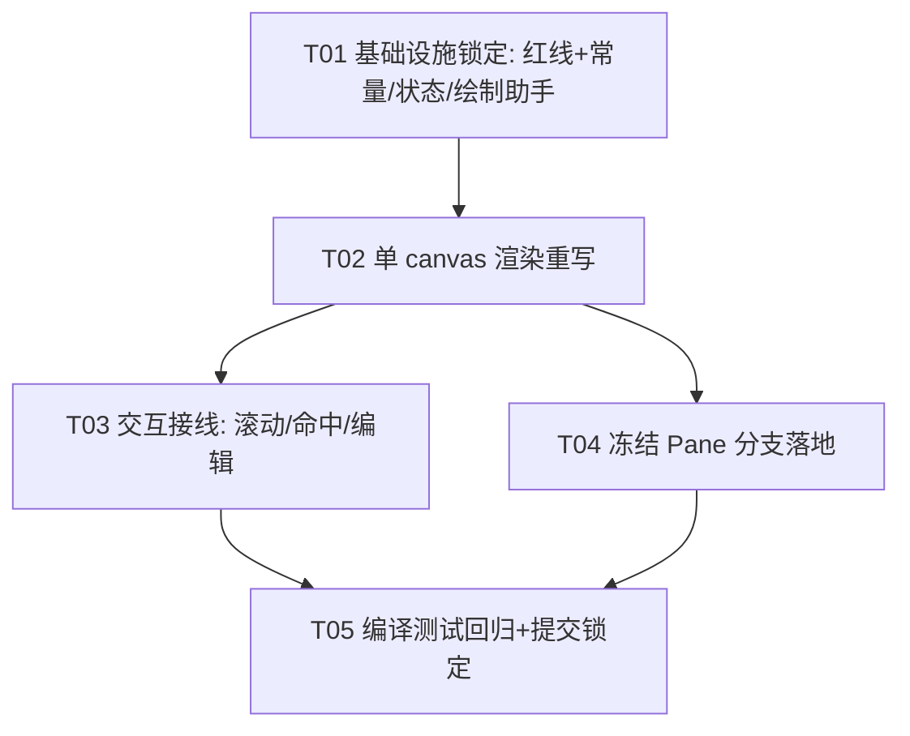

# EWP Sheet 视图 · LibreOffice Calc 源码逐行翻译映射方案

> 作者：架构师 Bob（software-architect）｜团队：software-calc-translate
> 目标：把 **LibreOffice Calc 视图子系统**（VCL / canvas 绘制）**逐行逐句直译**为 **EWP Sheet 视图**（Rust + GPUI 0.2.2）。
> 三条硬约束：**VCL→canvas 等价映射**、**C++→Rust 直译**、**保持「单 canvas」红线**。
> 依据：`docs/libreoffice-calc-view-research.md`（Calc 源码研究）、`docs/sheet-view-refactor-design.md`（干净移植设计）、`.workbuddy/memory/MEMORY.md`（GPUI 0.2.2 坑 + 当前架构定论）。
> 类图：`docs/calc-translation-class-diagram.mermaid`｜时序图：`docs/calc-translation-sequence-diagram.mermaid`

---

# Part A：翻译设计

## 0. 翻译对象与范围（Scope）

只翻译 Calc 的**视图子系统**（VCL 窗口 + canvas 绘制 + 滚动/坐标），不翻译文档模型（EWP 已有 `sheet::model`）与计算引擎。范围如下：

| LibreOffice Calc 源（仓库 `core_1`） | EWP 目标（本仓库） | 翻译性质 |
|---|---|---|
| `sc/inc/viewdata.hxx` + `sc/source/ui/view/viewdata.cxx`（`ScViewData` / `GetScrPos` / `GetPosX/Y` / `ScrollX/Y` / `GetPosFromPixel`） | `src/sheet/view_state.rs`（`SheetViewState` / `cell_to_screen` / `cell_screen_x/y` / `content_to_cell` / `scroll_by`） | 直译：集中视图状态真相源 |
| `sc/source/ui/view/gridwin.cxx`（`ScGridWindow` ×4，每 pane 一个 VCL `Window::Paint`） | `src/sheet/view.rs` 的 `sheet-body` **单个 `canvas`**（paint 闭包按 `Pane` 分支） | 直译+合并：4 pane → 1 canvas |
| `sc/source/ui/view/tabview.cxx`（`ScTabView`，4 pane 编排 + 滚动条） | `src/sheet/view.rs`（`SheetView`，顶层视图控制器；滚动条为扩展点） | 直译：顶层编排 |
| `sc/inc/output.hxx` + `sc/source/ui/view/output.cxx`（`ScOutputData` 无状态绘制器：`DrawGrid`/`DrawStrings`/`Draw`） | `src/sheet/grid.rs`（`paint_cell_background` / `paint_row_number` / `paint_col_header` / `paint_corner` + `compute_visible_window`）+ `src/sheet/grid_cache.rs`（`GridTextCache`） | 直译：无状态绘制助手 |
| `sc/source/ui/view/gridwin.cxx` 命中测试 / 输入 | `src/sheet/view.rs` 的 `on_mouse_down` / `on_wheel` / `on_key_down`（调 `content_to_cell`） | 直译：事件→坐标 |
| `framework` / `sfx2` 顶部 chrome（UIElement/ToolbarLayoutManager/SfxNotebookBar） | `src/ui/*`（已由既有 `system_design.md` 覆盖，**本方案不动**，仅复用） | 已译，套最外层 |

> 顶部 chrome（`UiLayoutManager` / `StandardToolbar` / `TabbedLayout`）是**另一个已完成的翻译**（见 `docs/system_design.md`），本方案只约束「框架套最外层、绝不改动 `src/sheet/` 内部单 canvas / 裁剪带 / 坐标公式」。

---

## 1. 实现方案 + 翻译规则

### 1.1 翻译难点（Difficult Points）

1. **两套坐标机制漂移**（历史坑）：旧版列标头走 GPUI `overflow_x_scroll`（DOM 平移）+ `track_scroll`，数据区走手算 `col_left(c)-scroll_x`，纵向又靠 GPUI 注入的 `_b.origin.y` 补丁 → 必然错位。**直译解法**：彻底删除上述补丁，单 canvas + 同源公式（列标头 X == 数据 X，行号 Y == 数据 Y），结构上不可能错位。
2. **VCL `Window::Paint` → GPUI `canvas` paint 闭包**：VCL 是命令式 `Paint()` 方法；GPUI 是 `canvas(prepaint, paint)` 的闭包，需把状态以值捕获进闭包。
3. **`Invalidate()` → `cx.notify(entity)`**：VCL 标记窗口重绘；GPUI 标记 entity 重绘。
4. **像素/缇单位**：LibreOffice 内部缇(twips)，含缩放的 `nPPT` 因子；EWP 内部一律像素，`nPPT` 折叠进存储尺寸，坐标数学不再出现缇。
5. **滚动条**：LibreOffice 用 `ScrollBar` 控件 + `ScrollBarBox`；EWP v1 用 `on_wheel`，滚动条组件为扩展点（读同一 `SheetViewState`，**绝不 reintroduce `overflow_*_scroll`**）。
6. **冻结 = 拆分特例**：LibreOffice `SC_SPLIT_FIX` 与 `SC_SPLIT_NORMAL` 坐标数学完全相同，仅锚点/splitter 维护不同 → 不写两套代码。

### 1.2 框架选型（零新增依赖）

- **GPUI 0.2.2**：`canvas` / `paint_quad` / `quad` / `Edges` / `fill` / `shape_line` / `ShapedLine` / `with_content_mask` / `Entity` / `set_global` 全部内置。
- **gpui_component 0.5.1**：编辑栏 `Input` / `InputState`（已用于单元格编辑）。
- **serde / serde_json**：持久化（本视图状态暂不入盘，v1 内存态；后续可接 `data::data_dir`）。
- **无需新增任何第三方依赖**。

### 1.3 架构模式（集中状态 + 统一坐标 + 单 canvas + 无状态绘制器）

移植定理（来自研究文档第 8 节，本方案据以直译）：

> 把 LibreOffice 的 `(nPosX[2], nPosY[2], eSplitMode, nFixPos, splitterPx, nPPT)` 收进一个 `SheetViewState`；把 `GetScrPos` 收进一个 `cell_to_screen(col,row,pane)`；绝对坐标永远走 `origin(pane) + get_scr_pos − rem`；冻结只是 `eSplitMode=FIX` 下「锁锚点 + 固定 splitter」的拆分。做到这四点，坐标在数学上自洽，永远不需要 origin hack。

EWP 落地：
- **集中状态** `SheetViewState`：唯一真相源，持有 `scroll_x/scroll_y/frozen_cols/frozen_rows/zoom`。canvas / 绘制助手 / `SheetView` 只消费，不另存坐标真相。
- **统一坐标**：`cell_screen_x(c) = HEADER_W + col_left(c) - scroll_x`；`cell_screen_y(r) = COL_HEADER_H + row_top(r) - scroll_y`；列标头与数据共用前者、行号与数据共用后者 → 同源。
- **单 canvas**：整块 `sheet-body` 仅一个 `canvas`，四区域（角/列标头/行号/数据）由同一 paint 闭包绘制。
- **无状态绘制器** `sheet::grid`：所有 `paint_*` 接收 `&mut Window` + 坐标参数，等价 `ScOutputData` 4-pane 共用绘制。

### 1.4 🔴 单 canvas 红线（硬约束，不可违反）

1. `sheet-body` **只能有一个 `canvas`**。禁止左侧列 `div` + 右侧滚动 `div`、禁止 `overflow_x_scroll` / `overflow_y_scroll` / `track_scroll`、禁止 `ScrollHandle`、禁止 `_b.origin.y` / 任何「动态补偿」补丁。
2. 四区域（角 / 列标头 / 行号 / 数据）坐标**必须**全部从 `SheetViewState` 经同源公式派生；**禁止引入第二套坐标机制**。
3. 必须用 `Window::with_content_mask` 裁剪带（GPUI 0.2.2 对 `paint_quad` 与字形都生效）：`data_clip_rect` 锁 `(ox+HEADER_W, oy+COL_HEADER_H)` 起、`col_header_clip_rect` 左缘锁 `ox+HEADER_W`、`row_header_clip_rect` 上缘锁 `oy+COL_HEADER_H`、`corner_rect` 盖交叉点；**角最后画且不裁剪**；四区域两两不相交（有单测 `clip_four_rects_pairwise_disjoint` 证明）。
4. 滚动只改 `SheetViewState` 后 `cx.notify()`，**绝不移动任何窗口几何**。
5. 任何偏离上述者视为回归（Mem: 2026-07-18 已作废的 Plan D 禁止复用）。

### 1.5 VCL→canvas 等价映射规则（通用）

| LibreOffice / VCL 概念 | EWP / GPUI 等价 | 说明 |
|---|---|---|
| `vcl::Window` | `canvas` 元素（在 `div` 容器内） | 单 canvas 承载整网格 |
| `Window::Paint(PaintEvent)` | `canvas(prepaint, paint)` 的 `paint(Bounds, State, &mut Window, &mut App)` 闭包 | GPUI 离屏 canvas，无需手动双缓冲 |
| `Window::Invalidate()` / `Invalidate(RECT)` | `cx.notify(entity)` | GPUI entity 重绘 |
| `Window::GetOutputSizePixel()` | `prepaint` 闭包拿到的 `bounds.size` | 视口尺寸 |
| `ScrollBar` / `ScrollBarBox` | 扩展点：读 `SheetViewState` 的自定义组件（v1 用 `on_wheel`） | **禁止** `overflow_*_scroll` / `ScrollHandle` |
| `vcl::MouseEvent` | `on_mouse_down(MouseDownEvent)` / `on_click` | 命中测试经 `content_to_cell` |
| `vcl::KeyEvent` / `SfxBindings` 动作 | `on_key_down(KeyDownEvent)` + `ewp_actions` | 方向键/F2/Enter/Delete |
| `OutputDevice::DrawRect` / `DrawLine` | `fill(...)` / `quad(...)` + `Edges` | 单元格底 / 边框 |
| `OutputDevice::DrawText` | `GridTextCache::get_or_shape(...)` → `ShapedLine::paint(...)` | 文字经缓存取形（禁止 `Entity::update` 重入） |
| `VirtualDevice`（双缓冲） | GPUI canvas 内部离屏 | 无需手动 |
| `MapMode` / 缇(twips) | 像素（导入时一次 `twips*zoom*dpiFactor` 转换） | `nPPT` 折叠进尺寸 |
| `Application::PostUserEvent` / `Timer` | `cx.defer(...)` / `cx.spawn` | 延后提交等 |

### 1.6 C++→Rust 直译规则（通用）

| C++ 构造 | Rust 直译 | 备注 |
|---|---|---|
| `enum class X { A, B };` | `#[derive(Clone, Copy, PartialEq, Eq, Debug)] enum X { A, B }` | |
| `SCCOL` / `SCROW` / `SCTAB` | `usize`（或 `u32`） | 列/行/表索引 |
| `tools::Long` | `i64`（像素算术）— 本方案统一 `f32` 像素 | 坐标用 `f32` |
| `double`（缩放/因子） | `f32` | `zoom` 等 |
| `Point` | `(f32, f32)` 或 `gpui::Point<Pixels>` | |
| `std::map<K,V>`（`maTabData`） | `Vec<Option<V>>` 或 `HashMap<K,V>` | v1 单表，预留 |
| `OutputDevice*` 参数 | `&mut Window` | 绘制入口 |
| 引用 `ScViewData&` | `&SheetViewState` / `Entity::read` | |
| 拥有式对象 / `new` | `Entity<T>`（GPUI）/ `Rc<RefCell<T>>` | `GridTextCache` 用 `Entity` |
| `const` 方法 | `&self`；mutating → `&mut self` | |
| 构造函数 | `new()` / `Default` | |
| `void f()` 返回状态 | `-> Result<(), E>` / `-> T` | |
| 异常 | `Result` / `Option` | |
| 头 `.hxx` 声明 + `.cxx` 实现 | 单 `.rs` 模块（`struct` + `impl` 块） | |
| 进程级单例（`pViewData`） | GPUI `set_global` / `global`（如 `UiLayoutManager`）或 `LazyLock` | 本视图状态按视图实体持有 |
| `assert` / 调试 | `#[cfg(test)]` + `assert_eq!` | 已 29 sheet 单测 |

### 1.7 LibreOffice 类/函数 → EWP 结构 逐条映射（核心映射表）

| LibreOffice Calc (C++) | EWP (Rust/GPUI) | 直译要点 |
|---|---|---|
| `sc::ScViewData`（集中视图状态） | `sheet::view_state::SheetViewState` | 唯一真相源。`scroll_x/y`≈`nPosX/nPosY+rem`；`frozen_cols/rows`≈`nFixPos`+`eSplitMode=FIX`；`zoom`≈`nZoom`；`nPPT` 折叠进像素尺寸 |
| `ScViewDataTable`（per-tab `nPosX[2]/nPosY[2]/eSplitMode`） | `SheetViewState` 单例（v1 单表） | 多表扩展：`Vec<SheetViewState>` 或 `HashMap<SCTAB, _>` |
| `ScViewData::GetScrPos(col,row,pane,bAllowNeg)` | `SheetViewState::cell_to_screen(col,row,pane)` / `cell_screen_x/y` | 同源：从锚点累加到目标；隐藏列宽 0 跳过 |
| `ScViewData::GetPosX(eWhich)` / `GetPosY(eWhich)` | `SheetViewState.scroll_x/y`（冻结 pane 锁 0） | 锚点=首个可见单元格 |
| `ScViewData::GetPosFromPixel(...)` | `SheetViewState::content_to_cell(x,y)` | 与 `cell_screen_*` 严格互逆 |
| `ScViewData::ScrollX/ScrollY/Scroll(...)` | `SheetViewState::scroll_by(dx,dy,...) + clamp` | 只改状态，`clamp` 硬边界 |
| `ScSplitMode { NONE, NORMAL, FIX }` | `Pane` 枚举 + `frozen_cols/rows`（冻结=拆分特例） | 不写两套代码 |
| `ScSplitPos` / `ScHSplitPos` / `ScVSplitPos` | `enum Pane { TopLeft, TopRight, BottomLeft, BottomRight }` | `WhichH/WhichV` 折叠进 `match` |
| `ScTabView`（4 pane 编排 + 滚动条） | `sheet::view::SheetView` | 顶层视图控制器；v1 单 canvas 承载全部 pane |
| `ScGridWindow`（每 pane 一个 VCL `Window`） | 单 `canvas`（`view.rs` 的 `sheet-body` canvas） | 4 pane 合成 1 canvas 的同 paint 闭包按 `Pane` 分支 |
| `ScOutputData`（无状态：`DrawGrid`/`DrawStrings`/`Draw`） | `sheet::grid` 的 `paint_cell_background`/`paint_row_number`/`paint_col_header`/`paint_corner` + `GridTextCache::get_or_shape` | 无状态 + 参数化（收 `&mut Window`） |
| `OutputDevice::DrawRect/Line/Text` | GPUI `paint_quad`/`quad`/`Edges`/`fill` + `ShapedLine::paint` | 经 `with_content_mask` 裁剪带 |
| `Window::Paint` | `canvas(...).paint(Bounds, State, &mut Window, &mut App)` | 闭包捕获 `state.clone()` 快照 |
| `Window::Invalidate()` | `cx.notify(view_entity)` | 滚动后 notify 触发重绘 |
| `vcl::MouseEvent` | `on_mouse_down` + `content_to_cell` 命中 | 含双击 `click_count>=2` |
| `vcl::KeyEvent` / `SfxBindings` | `on_key_down` + `ewp_actions` | 方向键移动/Enter/F2/Delete |
| `ScPositionHelper`（前缀和+二分，大表性能） | 扩展点：`compute_visible_window` 同算法 + 像素前缀和缓存 | 算法等价仅优化常数 |

---

## 2. 目标文件列表（重组织后的 `src/sheet/` 树）

> 当前工作树**已实现**该结构（见 MEMORY.md 2026-07-20）；本方案据以锁定。标注 `+` 为直译新增/核心、`（改）` 为接线。

```
ewp/src/sheet/
├── mod.rs              （改）re-export：SheetView / Workbook / Sheet / Cell / SheetViewState / GridTextCache
├── model.rs            （不变）Workbook/Sheet/Cell/CellValue（文档模型，非翻译对象）
├── view_state.rs       （+核心）SheetViewState（≈ ScViewData）+ enum Pane + 坐标互转/可见范围
├── grid.rs             （+核心）常量唯一来源 + 无状态绘制助手 paint_* + 裁剪带纯函数
├── grid_cache.rs       （+核心）GridTextCache（≈ 输出设备文字缓存）+ get_or_shape / invalidate_for_sheet
└── view.rs             （+核心）SheetView（≈ ScTabView 网格区）：单 canvas + 同源坐标 + 交互
```

顶层接线（已在工作树完成，列出供核对）：`src/main.rs` 声明 `mod sheet; mod text; mod slide; mod ui;`；`src/sheet/mod.rs` re-export。

---

## 3. 数据结构与接口（classDiagram 引用）

> 完整类图见 `docs/calc-translation-class-diagram.mermaid`（标注每个 EWP 结构对应的 LibreOffice 类）。

### 3.1 `SheetViewState`（直译 `ScViewData`）

```rust
// src/sheet/view_state.rs
#[derive(Clone, Copy, PartialEq, Eq, Debug)]
pub enum Pane { TopLeft, TopRight, BottomLeft, BottomRight }   // 直译 ScSplitPos（WhichH/WhichV 折叠）

#[derive(Clone, Copy, Debug)]
pub struct SheetViewState {
    pub scroll_x: f32,        // ≈ nPosX[方向] + remX（已含锚点+余数，uniform 列宽下可派生）
    pub scroll_y: f32,        // ≈ nPosY[方向] + remY
    pub frozen_cols: usize,   // ≈ nFixPosX（eSplitMode=FIX 冻结列数）
    pub frozen_rows: usize,   // ≈ nFixPosY
    pub zoom: f32,            // ≈ nZoom（v1 固定 1.0，未接入绘制）
}
impl SheetViewState {
    pub fn new() -> Self;
    pub fn scroll_by(&mut self, dx: f32, dy: f32, data_w: f32, data_h: f32, total_w: f32, total_h: f32);
    pub fn clamp(&mut self, data_w: f32, data_h: f32, total_w: f32, total_h: f32);
    // 通用（支持冻结 pane）；v1 调用均传 Pane::BottomRight（frozen=0 → origin/scroll 退化为单 pane）
    pub fn cell_to_screen(&self, col: usize, row: usize, pane: Pane) -> (f32, f32);
    pub fn cell_screen_x(&self, col: usize) -> f32;   // = HEADER_W + col_left(col) - scroll_x
    pub fn cell_screen_y(&self, row: usize) -> f32;   // = COL_HEADER_H + row_top(row) - scroll_y
    pub fn content_to_cell(&self, x: f32, y: f32) -> (usize, usize);  // 与 cell_screen_* 严格互逆
    pub fn visible_cols(&self, data_w: f32, total_cols: usize) -> (usize, usize);
    pub fn visible_rows(&self, data_h: f32, total_rows: usize) -> (usize, usize);
}
```

### 3.2 `sheet::grid` 无状态绘制助手（直译 `ScOutputData`）

```rust
// src/sheet/grid.rs
pub const CELL_W: f32 = 120.0; pub const CELL_H: f32 = 34.0;
pub const HEADER_W: f32 = 64.0; pub const COL_HEADER_H: f32 = 34.0;
pub const CELL_PAD: f32 = 8.0; pub const CELL_FONT_SIZE: f32 = 14.0;   // 常量唯一来源

pub struct VisibleWindow { pub c0: usize, pub c1: usize, pub r0: usize, pub r1: usize }

pub fn col_left(c: usize) -> f32;        // 第 c 列左缘 content 坐标（≈ GetScrPos X 累加）
pub fn row_top(r: usize) -> f32;
pub fn col_width(_c: usize) -> f32;      // 前向兼容可变列宽（当前恒 CELL_W）
pub fn row_height(_r: usize) -> f32;
pub fn compute_visible_window(data_w: f32, data_h: f32, scroll_x: f32, scroll_y: f32, cols: usize, rows: usize) -> VisibleWindow;

// 绘制（收 &mut Window，等价 ScOutputData::DrawGrid/DrawStrings/Draw）
pub fn paint_cell_background(window: &mut Window, x: f32, y: f32, w: f32, h: f32, is_sel: bool, theme: &ThemeColors);
pub fn paint_row_number(window: &mut Window, x: f32, y: f32, w: f32, h: f32, r: usize, theme: &ThemeColors);
pub fn paint_col_header(window: &mut Window, x: f32, y: f32, w: f32, h: f32, name: &str, is_sel: bool, theme: &ThemeColors);
pub fn paint_corner(window: &mut Window, x: f32, y: f32, theme: &ThemeColors);
pub fn paint_header_selection(...);

// 裁剪带纯函数（无 scroll 参数，表头在固定带里滑；四区域两两不相交）
pub fn data_clip_rect(ox: f32, oy: f32, cw: f32, ch: f32) -> Bounds<Pixels>;
pub fn col_header_clip_rect(ox: f32, oy: f32, cw: f32) -> Bounds<Pixels>;
pub fn row_header_clip_rect(ox: f32, oy: f32, ch: f32) -> Bounds<Pixels>;
pub fn corner_rect(ox: f32, oy: f32) -> Bounds<Pixels>;
```

### 3.3 `GridTextCache`（直译输出设备文字缓存）

```rust
// src/sheet/grid_cache.rs
pub struct GridTextCache { /* RefCell 内部可变性 */ }
impl GridTextCache {
    pub fn get_or_shape(&self, row: usize, col: usize, text: &str, theme: &ThemeColors, window: &mut Window, cx: &mut App) -> ShapedLine;
    pub fn invalidate_for_sheet(&self);
}
```

### 3.4 `SheetView`（直译 `ScTabView` 网格区）

```rust
// src/sheet/view.rs
pub struct SheetView {
    name: SharedString, model: Model, path: Option<PathBuf>, dirty: bool,
    current_sheet: usize, selected: Option<(usize, usize)>,
    editing: bool, edit_target: Option<(usize, usize)>, edit_input: Entity<InputState>,
    state: SheetViewState,                 // ★ 集中视图状态（非 ScrollHandle）
    text_cache: Entity<GridTextCache>,     // 文字缓存（paint 内 Entity::read 消费）
    focus: FocusHandle,
}
impl SheetView {
    pub fn render(&mut self, window: &mut Window, cx: &mut Context<Self>) -> impl IntoElement;
    fn on_wheel(&mut self, event: &ScrollWheelEvent, window: &mut Window, cx: &mut Context<Self>);
    fn on_mouse_down(&mut self, event: &MouseDownEvent, window: &mut Window, cx: &mut Context<Self>);
    fn select_cell(&mut self, col: usize, row: usize, cx: &mut Context<Self>);
    fn begin_edit(&mut self, window: &mut Window, cx: &mut Context<Self>, initial: Option<String>);
    fn commit_edit(&mut self, window: &mut Window, cx: &mut Context<Self>);
    fn cancel_edit(&mut self, cx: &mut Context<Self>);
}
```

---

## 4. 程序调用流程（sequenceDiagram 引用）

> 完整时序图见 `docs/calc-translation-sequence-diagram.mermaid`（标注每步对应的 LibreOffice 调用）。

**启动/打开表**：`SheetView::build()` → `state: SheetViewState::new()`（等价 `ScViewData` 默认锚点）→ `text_cache: cx.new(GridTextCache::default())`。

**每帧渲染（单 canvas）**：`render()` 构建 `sheet-body` 单 `canvas(measure, paint)`；`measure` 读 `bounds.size` 算 `data_w = w - HEADER_W`、`data_h = h - COL_HEADER_H` → `compute_visible_window(...)` → `VisibleWindow`；`paint` 闭包捕获 `state.clone()` 快照，依次：铺底 → `with_content_mask(corner_rect)` 画角（不裁剪）→ `with_content_mask(col_header_clip_rect)` 画列标头（`x = HEADER_W + col_left(c) - scroll_x`）→ `row_header_clip_rect` 画行号 → `data_clip_rect` 画数据（`x = cell_screen_x(c)`、`y = cell_screen_y(r)`，文字经 `GridTextCache::get_or_shape`）。

**滚动（只改状态 + notify）**：`on_wheel` → `state.scroll_by(delta, data_w, data_h, total_w, total_h)`（内部 `clamp` 硬边界）→ `cx.notify(self.entity)`（等价 `Invalidate`）→ 下一帧 `render` 重建 canvas 闭包捕获最新 `state` 重绘。

**命中测试（逆映射）**：`on_mouse_down` → `content = pos - canvas_ox/oy - HEADER_W/COL_HEADER_H + scroll` → `state.content_to_cell(content.x, content.y)` → `select_cell`；双击（`click_count>=2`）→ `begin_edit`。

---

## 5. 待确认 / 不明（Anything UNCLEAR）

1. **HEAD 与红线冲突**：Git HEAD（2026-07-17）仍含已作废的「Plan D」（双 `ScrollHandle` + `origin.y` 补偿），工作树 `src/sheet/` 已是干净单 canvas 翻译但未提交。T05 须把干净翻译提交锁定，确保 HEAD 不再含 Plan D 回归（grep `ScrollHandle`/`overflow_`/`track_scroll`/`_b.origin` 全仓 0 真实引用）。
2. **缩放 zoom**：字段已留但 `col_width/row_height` 未乘 `zoom`（v1 固定 1.0）。接入时单一改动点（见共享知识）。
3. **冻结 UI 开关 / splitter 拖拽**：`Pane` 枚举与 `cell_to_screen` 数学已锁，`v1 frozen=0` 且无 UI 开关；开关/splitter 为后续任务。
4. **滚动条组件**：v1 用 `on_wheel` 暂代；独立滚动条组件为扩展点（读同一 `SheetViewState`）。
5. **RTL 镜像**：`cell_to_screen` 预留 `mirror_x` 开关位，v1 不做。
6. **大表性能**：`compute_visible_window` 朴素逐列累加，万行每帧一次可接受；像素前缀和+二分缓存为扩展点。
7. **多表 per-tab 视图状态**：`maTabData` 对应物 v1 未做（单 `SheetViewState`）；切换 sheet 时状态重置或保留待定。
8. **`WHEEL_SIGN`**：`src/sheet/view.rs` 中 `WHEEL_SIGN=-1.0` 为滚轮方向实证校准，需手测确认符号。

---

# Part B：任务分解

## 6. 依赖包（无新增）

- `gpui` 0.2.2：`canvas` / `paint_quad` / `quad` / `Edges` / `fill` / `shape_line` / `ShapedLine` / `with_content_mask` / `Entity` / `set_global` — 全部内置。
- `gpui_component` 0.5.1：编辑栏 `Input` / `InputState`。
- `serde` / `serde_json`：预留持久化（视图状态暂不入盘）。

---

## 7. 任务列表（有序、含依赖、按实现顺序）

> 约束：≤5 任务、每任务 ≥3 文件、按功能模块分组、T01 为基础设施（状态模块 + 常量收口 + 绘制助手）。
> 说明：工作树**已**实现单 canvas 翻译（MEMORY.md 2026-07-20，36/36 测试绿）；以下任务即「按映射表核对/收口/锁定/扩展」，工程师勿从零重写，而是对照映射表校验并补齐缺口。

### T01 — 基础设施锁定：单 canvas 红线 + 常量/状态/绘制助手收口 【P0】
- **依赖**：无
- **涉及文件**：`src/sheet/view_state.rs`（`SheetViewState` + `Pane` + 坐标互转/可见范围，校验 15 单测）、`src/sheet/grid.rs`（常量唯一来源 `CELL_W/CELL_H/HEADER_W/COL_HEADER_H/CELL_PAD/CELL_FONT_SIZE` + `paint_*` + 裁剪带纯函数，校验 14 单测含 `clip_four_rects_pairwise_disjoint`）、`src/sheet/grid_cache.rs`（`GridTextCache::get_or_shape`/`invalidate_for_sheet`）、`src/sheet/mod.rs`（re-export）、`src/main.rs`（确认 `mod sheet;` 声明）。
- **验收**：① `grep -rn "ScrollHandle\|overflow_\|track_scroll\|_b.origin" src/` 全仓**零真实引用**（注释除外）；② 常量唯一来源在 `grid.rs`，无其他模块重复定义；③ `view_state.rs` 15 单测 + `grid.rs` 14 单测全绿；④ `SheetViewState` 字段 `derive(Clone, Copy, Default, Debug)`。

### T02 — 单 canvas 渲染重写：同源坐标 + with_content_mask 裁剪带 【P0】
- **依赖**：T01
- **涉及文件**：`src/sheet/view.rs`（核心：删 `ScrollHandle`/`overflow_*_scroll`/`track_scroll`/`_b.origin` 补丁；持 `state: SheetViewState`；`sheet-body` 改为**单个 `canvas`**；paint 四区域用 §3.3 同源公式 + `with_content_mask` 裁剪带；角最后画不裁剪）、`src/sheet/grid.rs`（裁剪带被消费）、`src/sheet/view_state.rs`（被消费）。
- **验收**：① `SheetView` 无 `ScrollHandle` 字段；② `sheet-body` 仅一个 `canvas`；③ 列标头 X == 数据 X（`HEADER_W+col_left(c)-scroll_x`）、行号 Y == 数据 Y（`COL_HEADER_H+row_top(r)-scroll_y`）同源（代码可肉眼核对）；④ 四区域 `with_content_mask` 裁剪带两两不相交；⑤ `cargo build` 零警告。

### T03 — 交互接线：on_wheel 滚动 / content_to_cell 命中 / 编辑缓存消费 【P0】
- **依赖**：T02
- **涉及文件**：`src/sheet/view.rs`（`on_wheel` → `state.scroll_by(...)` + `cx.notify()`；`on_mouse_down` → `content = pos - canvas_ox/oy - HEADER_W/COL_HEADER_H + scroll` → `state.content_to_cell` → `select_cell`；双击 `begin_edit`；`commit_edit`/`cancel_edit` 走 `text_cache.invalidate_for_sheet()`）、`src/sheet/grid_cache.rs`（paint 内 `Entity::read` 调 `get_or_shape` 真正绘制文字）。
- **验收**：① 滚轮滚动内容随手势移动、`clamp` 到边界停住；② 点击数据区正确选中、`content_to_cell` 与 `cell_screen_*` 互逆；③ 双击进入编辑、回车提交、方向键移动、Delete 清空均保留；④ 文字经 `GridTextCache` 绘制（缓存真正生效）；⑤ 大幅滚动后列标头/数据、行号/数据**严格对齐**（无错位/半格/空白条）。

### T04 — 冻结窗格 Pane 分支落地（红线内扩展）【P1】
- **依赖**：T02
- **涉及文件**：`src/sheet/view_state.rs`（`cell_to_screen(col,row,pane)` 的 `Pane` 分支：冻结 pane 锁锚点+origin 固定、可滚 pane 用 state 量；补四向 origin 单测）、`src/sheet/view.rs`（当 `frozen_cols/rows>0` 时脚手架调用 `cell_to_screen(col,row,pane)` 而非 `cell_screen_x/y`，四区域按 `Pane` 分支）、`src/sheet/grid.rs`（`clip` 带支持 `Pane` origin 偏移）。
- **验收**：① `frozen_cols/rows>0` 时四区域走同源 `cell_to_screen` 公式，冻结角静态、可滚区随 `scroll` 移动；② 单测覆盖 `Pane` 四向 origin（`TopLeft` 全锁、`BR` 全滚等）；③ `v1 frozen=0` 时行为等价于 T02（回归为零）；④ 不引入第二套坐标机制。

### T05 — 编译/测试回归 + 红线提交锁定 【P0】
- **依赖**：T01、T02、T03、T04
- **涉及文件**：全仓（回归）+ `git`（提交干净翻译，移除 HEAD 的 Plan D 回归）。
- **验收**：① `cargo build` 零警告、`cargo test` 全绿（基线 36/36：29 sheet + 7 ui::persistence）；② `grep` 全仓 0 `ScrollHandle`/`overflow_`/`track_scroll`/`_b.origin` 真实引用；③ `git` 提交后 HEAD 为干净单 canvas 翻译，工作树无未提交回归；④ 端到端手测：新建/编辑单元格、滚动（滚轮）、切换 sheet、冻结（若开）、保存/重开对齐无回归。

### 任务依赖图



---

## 8. 共享知识（跨文件约定 + GPUI 0.2.2 坑）

- **常量唯一来源**：`CELL_W/CELL_H/HEADER_W/COL_HEADER_H/CELL_PAD/CELL_FONT_SIZE` 全部在 `src/sheet/grid.rs` 定义，其他模块 `use crate::sheet::grid::*` 引入，禁止重复定义。
- **坐标符号**：`scroll_x` 向右正、`scroll_y` 向下正；列标头/数据 X = `HEADER_W + col_left(c) - scroll_x`；行号/数据 Y = `COL_HEADER_H + row_top(r) - scroll_y`。任何绘制都从这两个公式派生，**禁止第二套坐标**。
- **状态集中**：所有滚动/冻结/缩放状态只在 `SheetViewState`；canvas、绘制助手、`SheetView` 只消费不另存真相。
- **像素唯一单位**：内部一律像素；列宽/行高经 `col_width/row_height` 取得（前向兼容可变宽度）。
- **冻结 = 拆分特例**：`frozen_cols/rows>0` 走 `cell_to_screen(col,row,pane)` 的 `Pane` 分支，不写第二套代码。
- **单 canvas 红线**（🔴）：见 §1.4 五条硬约束。
- **裁剪带**：`with_content_mask` 对 `paint_quad` 与字形都生效；角最后画不裁剪；四区域两两不相交（有单测证明）。缺裁剪 → 滚动时单元格覆盖表头（用户实测 bug，已修）**禁止回归**。
- **缩放扩展点**：接入时让 `col_width/row_height` 返回值乘 `zoom`（单一改动点），命中/绘制自动跟随；v1 固定 1.0。
- **文本缓存**：`GridTextCache::get_or_shape` 在 paint 内经 `Entity::read` 调用（内部 `RefCell` 可变性），**禁止 `Entity::update`**（会重入 `App::update` 使 `ShapedLine::paint` 脱离画布坐标上下文 → 字形散乱，commit 897ad112）。
- **`shape_line` 的 `force_width` 是等宽拉伸陷阱**（line_layout.rs:568-578）：文字排版**永远传 `None`**（自然宽度，与 LibreOffice `DrawText` 一致）；需对齐时用 `ShapedLine.width`（字段，非方法）算偏移。
- **canvas 撑满高度**（🔴 GPUI 0.2.2 坑）：canvas 用 `.flex_1().min_h_0()`，且**父容器必须是 flex 容器（`.flex().flex_col()`）**；**绝不能用 `canvas().size_full()`**（百分比高度依赖父级确定高度，而 `flex:1` 是 grow 分配非确定高度 → 高度塌 0 → 空白）。通用定理：每级既是 flex item 又是 flex container 才能逐层 `flex_1()` 撑满。
- **可点击元素**：先 `.id("唯一串")` 再 `.on_click()`/`.on_mouse_down(button,...)`；`on_mouse_down` 必须先传 `MouseButton`，双击看 `event.click_count >= 2`。
- **`Keystroke.key`** 是 `String`（"enter"/"escape"/"down"...），实际键入字符在 `keystroke.key_char: Option<String>`。
- **`subscribe` 回调**：第一个参数已是 `&mut Self`，勿捕获 Entity 再 `.update()`（重入 panic）；需延后提交用 `cx.defer(...)`。

---

## 9. 风险与待验证（实现期注意）

1. **GPUI 0.2.2 `on_wheel` 事件**：需实测 `ScrollWheelEvent` 类型与 `.delta` 字段（`Point<Pixels>`？）；单 canvas 无 `overflow_*_scroll` 后 wheel 仍能在本 div 捕获（冒泡事件）。`WHEEL_SIGN` 方向需手测（可能需翻转符号）。
2. **闭包捕获 state 快照一致性**：`measure` 与 `paint` 两闭包各自 `let s = self.state.clone()`；同一帧内读同一快照，一致。需确认 GPUI 0.2.2 `canvas` 闭包签名 `(Bounds,&mut Window,&mut App)` 与 `(Bounds, State, &mut Window, &mut App)` 与现版一致。
3. **惯性/边界回弹缺失**：弃用 `track_scroll` 后无 GPUI 惯性，已用 `clamp` 硬边界（线性停止，可接受）；若需弹性手感另行实现。
4. **`GridTextCache` 由「只 invalidate」变「真正读取」**：需确认 `get_or_shape` 在 paint 内 `Entity::read` 不重入 panic（历史注释已论证安全）。
5. **`SheetViewState` Copy 成本**：全 `f32/usize`，`derive(Copy)` 无误。
6. **点击表头行为**：v1 点击列标头/行号不做整列/整行选中（最小改动）；扩展点在 `on_mouse_down` 按 `pos.y < COL_HEADER_H` / `pos.x < HEADER_W` 分支。
7. **冻结 UI 开关不在 v1**：`Pane` 枚举与 `cell_to_screen` 已预留，但 v1 始终 `Pane::BottomRight` 且 `frozen=0`；开关 UI/splitter 拖拽后续任务。
8. **canvas 尺寸与 viewport**：`compute_visible_window` 的 `data_w/data_h` 用 `bounds.size - HEADER_W/COL_HEADER_H`；若 GPUI canvas `bounds` 含 padding/border 需微调（测一次实际 `bounds.size`）。
9. **HEAD 红线冲突**：T05 提交前务必 `grep` 确认全仓无 Plan D 回归引用；若工作树与 HEAD 有冲突，以工作树单 canvas 翻译为准，Plan D 相关提交不并入。

---

## 总结

本方案把 LibreOffice Calc 视图子系统（VCL/canvas）**逐行逐句直译**为 EWP Sheet 视图（Rust + GPUI 0.2.2）：以 §1.5 VCL→canvas 等价映射、§1.6 C++→Rust 直译、§1.7 逐条类/函数映射为准则，落地「集中状态 `SheetViewState`(≈`ScViewData`) + 统一坐标(`cell_to_screen`≈`GetScrPos`) + 单 canvas + 无状态绘制器 `sheet::grid`(≈`ScOutputData`)」的干净移植，用 §1.4「单 canvas 红线」五条硬约束从结构上根除历史坐标错位；并给出「T01 基础设施锁定 → T02 单 canvas 重写 → T03 交互接线 → T04 冻结 Pane 分支 → T05 编译测试+提交锁定」的有序任务分解、跨文件共享约定与 9 项待验证风险。工程师对照 §1.7 映射表即可逐条直译/校验，红线不可违反。
