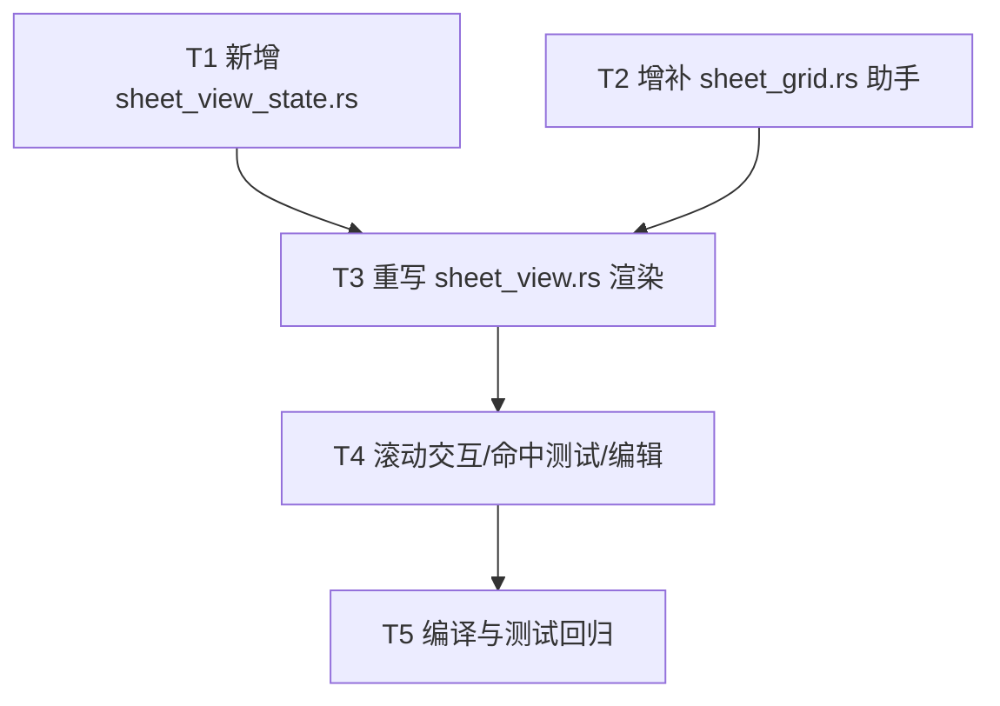

# EWP Sheet 视图重构设计：LibreOffice Calc 架构的干净移植

> 作者：架构师（高见远） ｜ 目标：消除当前"冻结窗格 / 滚动坐标错位"问题
> 依据：`docs/libreoffice-calc-view-research.md` 第 8 节「移植定理」

---

## 1. 实现方案概述

把 LibreOffice Calc 的视图架构映射到 Rust + GPUI 0.2.2，核心是**「集中状态 + 统一坐标」**两件事：

| LibreOffice 概念 | 本方案对应 |
|---|---|
| `ScViewData`（集中状态真相源） | 新增 `src/sheet_view_state.rs` 的 `SheetViewState`（持有 `scroll_x/scroll_y` + `frozen_cols/rows` + `zoom`） |
| `ScGridWindow` × 4（每 pane 一个窗口） | **弃用** 4 个 DOM 滚动容器 → **单个铺满网格视口的 `canvas`** |
| `ScOutputData`（无状态绘制器） | 复用 `sheet_grid.rs` 的 `col_left/row_top/compute_visible_window/paint_*` 无状态助手 |
| `GetScrPos` + `origin(pane) + get_scr_pos − rem` | `SheetViewState::cell_to_screen(col,row,pane)` 统一公式 |
| 滚动只更新 `ScViewData` 后 `Invalidate` | 滚动只更新 `SheetViewState` 后 `cx.notify()` |

**为何单 canvas + ViewState 能根除错位**：当前错位的根本原因是**两套不同的坐标机制**——列标头靠 GPUI `overflow_x_scroll`（DOM 平移）+ `track_scroll(hscroll)`，数据区靠 `col_left(c) - scroll_x` 手算 X，纵向又靠 GPUI 注入的 `_b.origin.y` 动态偏移 + `row_top(r) - scroll_y + origin.y` 补丁。两套机制各自漂移，自然错位。新方案**彻底删除 `overflow_*_scroll`/`track_scroll`/`ScrollHandle`/`_b.origin` 补丁**，整张网格（角 + 列标头 + 行号 + 数据）由**同一个 `canvas` 的同一个 paint 闭包**用**同一个公式**绘制。列标头的 X 与数据区的 X 是**同一个表达式** `HEADER_W + col_left(c) - scroll_x`；行号的 Y 与数据区的 Y 是**同一个表达式** `COL_HEADER_H + row_top(r) - scroll_y`。二者数学同源，结构上不可能再错位。这正对应研究文档的移植定理：**绝对坐标永远走 `origin(pane) + get_scr_pos − rem`，冻结只是 `eSplitMode=FIX` 下锁锚点 + 固定 splitter 的拆分**。

---

## 2. 文件清单

| 动作 | 文件（相对 `ewp/`） | 职责 | 备注 |
|---|---|---|---|
| **新增** | `src/sheet_view_state.rs` | `SheetViewState` 集中视图状态（类比 `ScViewData`），含滚动/clamp/坐标互转/pane 映射方法 | 本次核心新增 |
| **修改** | `src/main.rs` | 增加 `mod sheet_view_state;` 模块声明 | 一行 |
| **修改** | `src/sheet_grid.rs` | 把常量收口为唯一来源（新增 `pub const COL_HEADER_H`）；新增无状态绘制助手 `paint_col_header` / `paint_corner` / `paint_header_selection`；保留 `col_left/row_top/col_width/row_height/compute_visible_window/paint_cell_background/paint_row_number` 及现有 `#[cfg(test)]` | 既有测试全部保留，仅需确认常量来源一致 |
| **修改** | `src/sheet_view.rs` | 删除 `hscroll/vscroll` 两个 `ScrollHandle` 及其 `overflow_*_scroll`/`track_scroll` 布局；改为持有 `SheetViewState`；整块 `sheet-body` 用**单个 `canvas`** 绘制四区域；滚动改 `on_wheel`；命中测试改用 `state.content_to_cell`；删除 `COL_HEADER_H` 等重复常量（改为从 `sheet_grid` 引入）；在 paint 中真正使用 `GridTextCache` | 改动最大，但逻辑结构清晰 |
| **保留** | `src/sheet_grid_cache.rs` | `GridTextCache` 文字缓存。当前代码**只创建 + `invalidate_for_sheet()`，paint 里并未读它**（直接 `shape_line`）。本次在 paint 中**真正调用 `get_or_shape`** 发挥缓存作用 | 不变，仅消费方改变 |
| **不变** | `src/model/sheet.rs`、`src/styles.rs`、`src/data.rs` 等 | 数据模型 / 主题 / 存储 | 无需改动 |

**测试文件处理**：`sheet_grid.rs` 末尾的 `#[cfg(test)]`（7 个 `compute_visible_window` / 坐标常量测试）**全部保留**，它们直接调用 `compute_visible_window`，与滚动表示法无关，仍成立。`sheet_view_state.rs` 新增测试：验证 `clamp` 边界、`scroll_by` 后 clamp、`cell_to_screen` 同源公式、`content_to_cell` 逆映射正确。`sheet_view.rs` 的现有逻辑测试（如有）无需因坐标机制改动而重写。

---

## 3. 数据结构与接口

### 3.1 常量归属（单一来源）

统一在 `sheet_grid.rs` 暴露，其余模块 `use crate::sheet_grid::*` 引入，**禁止重复定义**：

```rust
// sheet_grid.rs
pub const CELL_W: f32 = 100.0;
pub const CELL_H: f32 = 28.0;
pub const HEADER_W: f32 = 56.0;      // 左侧行号列宽
pub const COL_HEADER_H: f32 = 28.0;  // ★ 本次从 sheet_view.rs 迁入，作为唯一来源
pub const CELL_PAD: f32 = 4.0;
pub const CELL_FONT_SIZE: f32 = 13.0;
```

> `sheet_view.rs` 当前重复定义 `CELL_W/CELL_H/HEADER_W/COL_HEADER_H/CELL_PAD/CELL_FONT_SIZE` —— 全部删除，改为引入。

### 3.2 `SheetViewState`（类比 `ScViewData`）

采用**连续像素滚动**作为唯一真相（等价于 LibreOffice 的 anchor+余数合并形式；uniform 列宽下 `anchor = floor(scroll_x/CELL_W)`、`rem = scroll_x % CELL_W` 可随时派生，无需额外存）。

```rust
// src/sheet_view_state.rs
use crate::sheet_grid::{col_left, row_top, col_width, row_height,
                        HEADER_W, COL_HEADER_H, compute_visible_window, VisibleWindow};

/// 4 个 pane 标识（冻结 = 拆分的特例；v1 仅用 BottomRight）。
#[derive(Clone, Copy, PartialEq, Eq, Debug)]
pub enum Pane { TopLeft, TopRight, BottomLeft, BottomRight }

/// 集中视图状态 —— 唯一真相源（类比 LibreOffice ScViewData）。
/// 全部坐标状态都在这里；canvas / 绘制助手无状态地消费它。
#[derive(Clone, Copy, Debug)]
pub struct SheetViewState {
    /// 横向已滚动像素（向右滚为正，等价 LibreOffice 余数 remX，已含锚点）。
    pub scroll_x: f32,
    /// 纵向已滚动像素（向下滚为正）。
    pub scroll_y: f32,
    /// 冻结列数（0 = 不冻结）。冻结区恒锁锚点、splitter 固定 = 拆分的特例。
    pub frozen_cols: usize,
    /// 冻结行数（0 = 不冻结）。
    pub frozen_rows: usize,
    /// 缩放（1.0 = 100%）。v1 固定 1.0，未接入 UI（扩展点）。
    pub zoom: f32,
}

impl Default for SheetViewState {
    fn default() -> Self {
        Self { scroll_x: 0.0, scroll_y: 0.0, frozen_cols: 0, frozen_rows: 0, zoom: 1.0 }
    }
}

impl SheetViewState {
    pub fn new() -> Self { Self::default() }

    // —— 冻结几何（派生）——
    fn frozen_cols_px(&self) -> f32 { col_left(self.frozen_cols) }
    fn frozen_rows_px(&self) -> f32 { row_top(self.frozen_rows) }

    // —— pane 原点（拆分线像素位置），对应研究文档 3.3 节 originX/originY ——
    fn pane_origin(&self, pane: Pane) -> (f32, f32) {
        let ox = if matches!(pane, Pane::TopRight | Pane::BottomRight) { self.frozen_cols_px() } else { 0.0 };
        let oy = if matches!(pane, Pane::BottomLeft | Pane::BottomRight) { self.frozen_rows_px() } else { 0.0 };
        (ox, oy)
    }
    // 该 pane 方向的滚动贡献：冻结(上/左) pane 锁死为 0，可滚(下/右) pane 用 state 滚动量。
    fn pane_scroll_x(&self, pane: Pane) -> f32 {
        if matches!(pane, Pane::TopLeft | Pane::BottomLeft) { 0.0 } else { self.scroll_x }
    }
    fn pane_scroll_y(&self, pane: Pane) -> f32 {
        if matches!(pane, Pane::TopLeft | Pane::TopRight) { 0.0 } else { self.scroll_y }
    }

    // —— 滚动：只更新状态，不做任何窗口几何移动（对应研究文档 5.2 节）——
    /// 增量滚动并 clamp。data_w/data_h = 数据区视口尺寸（已扣表头）；total_w/total_h = 整表像素尺寸。
    pub fn scroll_by(&mut self, dx: f32, dy: f32,
                     data_w: f32, data_h: f32, total_w: f32, total_h: f32) {
        self.scroll_x += dx;
        self.scroll_y += dy;
        self.clamp(data_w, data_h, total_w, total_h);
    }

    /// 把 scroll 夹到 [0, max(0, total - data)]。
    pub fn clamp(&mut self, data_w: f32, data_h: f32, total_w: f32, total_h: f32) {
        let max_x = (total_w - data_w).max(0.0);
        let max_y = (total_h - data_h).max(0.0);
        self.scroll_x = self.scroll_x.clamp(0.0, max_x);
        self.scroll_y = self.scroll_y.clamp(0.0, max_y);
    }

    // —— 坐标映射：绝对屏幕坐标 = origin(pane) + get_scr_pos − rem ——
    /// 通用（支持冻结 pane）。v1 调用均传 Pane::BottomRight（frozen=0 → origin/scroll 退化为单 pane）。
    pub fn cell_to_screen(&self, col: usize, row: usize, pane: Pane) -> (f32, f32) {
        let (ox, oy) = self.pane_origin(pane);
        let sx = self.pane_scroll_x(pane);
        let sy = self.pane_scroll_y(pane);
        let x = HEADER_W + ox + col_left(col) - sx;
        let y = COL_HEADER_H + oy + row_top(row) - sy;
        (x, y)
    }
    /// 数据区（v1 唯一 pane）便捷方法，已含表头偏移。
    pub fn cell_screen_x(&self, col: usize) -> f32 { HEADER_W + col_left(col) - self.scroll_x }
    pub fn cell_screen_y(&self, row: usize) -> f32 { COL_HEADER_H + row_top(row) - self.scroll_y }

    // —— 逆映射：屏幕(内容)坐标 → 单元格（命中测试）——
    /// x/y 为已减去表头偏移后的「数据区内容坐标」（即 screen - HEADER_W + scroll_x）。
    pub fn content_to_cell(&self, x: f32, y: f32) -> (usize, usize) {
        let mut c = 0usize; let mut acc = 0.0;
        while acc + col_width(c) <= x { acc += col_width(c); c += 1; }
        let mut r = 0usize; let mut acy = 0.0;
        while acy + row_height(r) <= y { acy += row_height(r); r += 1; }
        (c, r)
    }

    // —— 可见范围（复用无状态 compute_visible_window）——
    pub fn visible_cols(&self, data_w: f32, total_cols: usize) -> (usize, usize) {
        let w = compute_visible_window(data_w, f32::MAX, self.scroll_x, 0.0, total_cols, 1);
        (w.c0, w.c1)
    }
    pub fn visible_rows(&self, data_h: f32, total_rows: usize) -> (usize, usize) {
        let w = compute_visible_window(f32::MAX, data_h, 0.0, self.scroll_y, 1, total_rows);
        (w.r0, w.r1)
    }
}
```

### 3.3 坐标公式（证明列标头与数据区同源）

设 `VisibleWindow { c0..c1, r0..r1 }` 由 `compute_visible_window(data_w, data_h, scroll_x, scroll_y, cols, rows)` 算出（数据区视口尺寸 = canvas 尺寸 − `HEADER_W` − `COL_HEADER_H`）。

在单一 canvas 的 paint 闭包中，四区域坐标**全部来自 `SheetViewState`**：

```
角 corner      : x = 0,                  y = 0
列标头 col c   : x = HEADER_W + col_left(c) - scroll_x,   y = 0
行号   row r   : x = 0,                  y = COL_HEADER_H + row_top(r) - scroll_y
数据格 (c,r)   : x = HEADER_W + col_left(c) - scroll_x,   y = COL_HEADER_H + row_top(r) - scroll_y
```

**同源证明**：
- 数据格 X = `HEADER_W + col_left(c) - scroll_x`；列标头 X = **同一个表达式**（仅 `y` 取 0）。→ 列标头与数据列横向永远对齐。
- 数据格 Y = `COL_HEADER_H + row_top(r) - scroll_y`；行号 Y = **同一个表达式**（仅 `x` 取 0）。→ 行号与数据行纵向永远对齐。
- 二者共用 `col_left/row_top/scroll_x/scroll_y` 同一组输入，不存在第二套坐标机制（无 GPUI 平移、无 `_b.origin` 补丁）。**错位在结构上不可能发生。**

> 冻结时（`frozen_cols/rows > 0`），改用 `cell_to_screen(c, r, pane)`：冻结 pane 的 `pane_scroll=0`、origin 固定，可滚 pane 的 origin = 冻结像素、scroll 用 state 量——同一公式，只是 `pane` 参数不同，依然同源。v1 frozen=0，等价退化为上式。

### 3.4 `SheetView` 结构变更

```rust
pub struct SheetView {
    name: SharedString,
    model: Model,
    path: Option<PathBuf>,
    dirty: bool,
    current_sheet: usize,
    selected: Option<(usize, usize)>,
    editing: bool,
    edit_target: Option<(usize, usize)>,
    edit_input: Entity<InputState>,
    // ★ 删除 hscroll: ScrollHandle / vscroll: ScrollHandle
    state: SheetViewState,                       // ★ 新增：集中视图状态
    text_cache: Entity<GridTextCache>,           // 保持不变（本次真正被 paint 消费）
    focus: FocusHandle,
    // ... 其余字段（name/model/path/dirty/selected/editing/...）全部不变
}
```

`build()` 中：`state: SheetViewState::new()` 取代两个 `ScrollHandle::new()`。

---

## 4. 绘制主流程

> 关键：整块 `sheet-body` 现在是**一个 `canvas`**（不再有左侧列 div + 右侧滚动区 div）。canvas 尺寸由外层 flex 容器撑满（`size_full()`）。measure 闭包读 `state` 与可用视口尺寸算可见窗口；paint 闭包用 §3.3 同源公式画四区域。

```mermaid
flowchart TD
    A[render: 构建 sheet-body 单 canvas] --> B[measure 闭包: 读 state.scroll_x/y + 可用 bounds b]
    B --> C[data_w = b.width - HEADER_W; data_h = b.height - COL_HEADER_H]
    C --> D[VisibleWindow = compute_visible_window(data_w, data_h, scroll_x, scroll_y, cols, rows)]
    D --> E[paint 闭包: 铺整 canvas 底 content_bg]
    E --> F[画角 corner: 0,0,HEADER_W,COL_HEADER_H]
    F --> G[画列标头: for c in c0..c1\n x = HEADER_W+col_left c - scroll_x, y=0\n paint_col_header]
    G --> H[画行号: for r in r0..r1\n y = COL_HEADER_H+row_top r - scroll_y, x=0\n paint_row_number]
    H --> I[画数据: for r in r0..r1, c in c0..c1\n x = cell_screen_x c, y = cell_screen_y r\n paint_cell_background + GridTextCache.get_or_shape 文字]
    I --> J[选中格高亮由 paint_cell_background(is_selected) 处理]
```

步骤说明：
1. `render` 计算 `cols/rows`（与现有一致：声明范围与已写入边界取大，不低于 `DEF_COLS/DEF_ROWS`），`total_w = col_left(cols)`、`total_h = row_top(rows)`。
2. `sheet-body` = `div().flex_1().min_h_0().on_wheel(...).child(canvas(measure, paint).size_full())`。
3. **measure**：`_b` 为 canvas 可用 bounds；`data_w = _b.size.width - HEADER_W`，`data_h = _b.size.height - COL_HEADER_H`；返回 `compute_visible_window(...)`（类型 `VisibleWindow`，与现有一致）。
4. **paint**：先铺底；再依次画角 → 列标头 → 行号 → 数据；数据区用 `state.cell_screen_x/y` 定位，文字经 `text_cache.read(cx).get_or_shape(...)` 取/绘（替换原内联 `shape_line`）。
5. 滚动触发：`on_wheel` 更新 `state.scroll_by(...)` 后 `cx.notify()` → 下一帧 `render` 重建 canvas 闭包（捕获最新 `state` 快照）→ 重绘。

---

## 5. 任务分解（有序，含依赖与验收点）

> 约束：≤ 5 个任务、按功能分组、T1 为基础设施（状态模块）。T1 与 T2 可并行；T3 依赖 T1+T2；T4 依赖 T3；T5 依赖 T4。

### T1 — 新增 `sheet_view_state.rs`（集中视图状态）
- **涉及文件**：`src/sheet_view_state.rs`（新）、`src/main.rs`（+`mod sheet_view_state;`）、`src/sheet_grid.rs`（常量收口：新增 `pub const COL_HEADER_H`，其余已存在）
- **依赖**：无
- **验收点**：
  - `SheetViewState` 含 `scroll_x/scroll_y/frozen_cols/frozen_rows/zoom` 字段并 `derive(Clone, Copy, Default, Debug)`。
  - `clamp` 在 `total < data` 时夹到 0（不越界）；`scroll_by` 后调用 `clamp`。
  - `cell_screen_x(col)` / `cell_screen_y(row)` 返回含表头偏移的屏幕坐标。
  - `cell_to_screen(col,row,pane)` 实现 pane origin/scroll 分支（冻结特例）。
  - `content_to_cell` 逆映射正确（对 `(col_left(c), row_top(r))` 返回 `(c, r)`）。
  - 新增单元测试覆盖上述四点。
  - `cargo build` 通过（模块已声明）。

### T2 — 增补 `sheet_grid.rs` 无状态绘制助手 + 常量收口
- **涉及文件**：`src/sheet_grid.rs`（新增 `COL_HEADER_H` 常量、`paint_col_header` / `paint_corner` / `paint_header_selection` 函数）、`src/sheet_view.rs`（删除重复常量，改为 `use` 引入）
- **依赖**：无（可与 T1 并行）
- **验收点**：
  - `pub const COL_HEADER_H: f32 = 28.0;` 在 `sheet_grid.rs` 唯一定义；`sheet_view.rs` 不再声明 `COL_HEADER_H` 等重复常量（编译无 `unused`/`duplicate`）。
  - `paint_col_header(window, x, y, w, col_name, is_selected, theme)` 画单列标头（底纹 + 右边框 + 文字 `col_name`）。
  - `paint_corner(window, theme)` 画左上角固定方块。
  - `paint_header_selection` 可选（列/行选中高亮）。
  - 现有 `#[cfg(test)]` 全部通过（`cargo test sheet_grid`）。

### T3 — 重写 `sheet_view.rs` 渲染：单 canvas + 统一坐标
- **涉及文件**：`src/sheet_view.rs`（核心重写：删 `hscroll/vscroll` 与 `overflow_*_scroll`/`track_scroll` 布局；持 `state: SheetViewState`；`sheet-body` 改为单 `canvas`；paint 用 §3.3 同源公式）
- **依赖**：T1、T2
- **验收点**：
  - `SheetView` 无 `ScrollHandle` 字段；`build()` 用 `SheetViewState::new()`。
  - `sheet-body` 仅一个 `canvas`，不再有左侧列 div / 右侧滚动 div，`overflow_*_scroll`/`track_scroll` 调用全部移除。
  - paint 四区域（角/列标头/行号/数据）坐标全部来自 `state`；列标头 X 与数据 X 同源、行号 Y 与数据 Y 同源（代码可肉眼核对）。
  - `compute_visible_window` 入参 `data_w = viewport_w - HEADER_W`、`data_h = viewport_h - COL_HEADER_H`。
  - 编译通过；静态布局（角/标头尺寸）与旧版一致。

### T4 — 接线滚动交互 / 命中测试 / 编辑（保留现有功能）
- **涉及文件**：`src/sheet_view.rs`（加 `on_wheel` 滚动；`on_mouse_down` 命中测试改用 `state.content_to_cell`；paint 真正消费 `GridTextCache::get_or_shape`）、`src/sheet_grid_cache.rs`（不变，仅被消费）
- **依赖**：T3
- **验收点**：
  - `on_wheel`：更新 `state.scroll_by(delta, data_w, data_h, total_w, total_h)` + `cx.notify()`；滚动后内容随手势移动、到边界 clamp 停住。
  - 点击数据区：`content_x = pos.x - HEADER_W + scroll_x`，`content_y = pos.y - COL_HEADER_H + scroll_y`，`(c,r) = state.content_to_cell(content_x, content_y)`，调 `select_cell`；双击进入 `begin_edit`（与现有一致）。
  - 编辑栏 / 单元格选中 / Enter 提交 / F2 编辑 / 方向键移动 / Delete 清空 / 底部工作表标签 / 工具栏保存 / 状态栏：逻辑**全部不变**，仅去掉对 `hscroll`/`vscroll` 的引用。
  - 提交/清空时仍调 `text_cache.invalidate_for_sheet()`；paint 内改为 `text_cache.read(cx).get_or_shape(...)` 绘制非空白格文字（缓存真正生效）。
  - 人工验证：大幅滚动后列标头与数据列、行号与数据行**严格对齐**（无错位/无半高/无空白条）。

### T5 — 编译与现有测试 / 回归
- **涉及文件**：全仓（回归）
- **依赖**：T4
- **验收点**：
  - `cargo build` 无错无警告（`ScrollHandle`/`overflow_*_scroll`/`track_scroll` 无残留引用）。
  - `cargo test` 全绿（含 `sheet_grid` 既有 7 个测试 + T1 新增测试）。
  - 端到端手测：新建单元格、编辑、滚动（滚轮）、切换 sheet、保存/重开文件后滚动状态合理、对齐无回归。
  - 可选增强（不阻塞）：鼠标拖拽平移（在 `on_mouse_down`+`on_mouse_move` 中按位移 `scroll_by`）；滚动条组件（见 §6 扩展点）。

### 任务依赖图



---

## 6. 共享知识 / 约定

- **常量唯一来源**：`CELL_W/CELL_H/HEADER_W/COL_HEADER_H/CELL_PAD/CELL_FONT_SIZE` 全部在 `sheet_grid.rs` 定义，其他模块 `use crate::sheet_grid::*` 引入。任何新增尺寸常量都放这里。
- **坐标符号约定**：`scroll_x` 向右滚为正，`scroll_y` 向下滚为正；列标头/数据 X 公式 `HEADER_W + col_left(c) - scroll_x`；行号/数据 Y 公式 `COL_HEADER_H + row_top(r) - scroll_y`。任何绘制都从这两个公式派生，禁止再引入 `_b.origin`/GPUI 平移第二套坐标。
- **状态集中**：所有滚动/冻结/缩放状态只在 `SheetViewState`；canvas、绘制助手、`SheetView` 持有/消费但不另存坐标真相。
- **像素为唯一单位**：内部一律像素；列宽/行高经 `col_width/row_height`（已留可变前向兼容位）取得，未来接可变列宽不改调用方。
- **冻结 = 拆分的特例**：`frozen_cols/rows > 0` 时走 `cell_to_screen(col,row,pane)` 的 pane 分支（冻结 pane 锁锚点 + 固定 origin），不写第二套代码。v1 frozen=0。
- **滚动条扩展点**：后续滚动条作为**独立组件**，读取同一 `SheetViewState`（`scroll_x/y` 与 `max_scroll`）绘制 thumb，**绝不为滚动条 reintroduce GPUI `overflow_*_scroll` 平移**。
- **缩放扩展点**：`zoom` 字段已留；接入时让 `col_width/row_height` 返回值乘 `zoom`（单一改动点），命中测试/绘制自动跟随——v1 固定 1.0。
- **可变列宽/行高扩展点**：`sheet_grid.rs` 的 `col_width/row_height(_c)` 当前返回常量，未来读 `Sheet` 列宽表即可，绘制与 `compute_visible_window` 调用方零改动。
- **RTL 镜像扩展点**：`cell_to_screen` 预留 `mirror_x` 开关位（X 做镜像），不影响核心数学；v1 不做。
- **大表性能扩展点**：`compute_visible_window` 逐列累加，万行级每帧只算一次可见窗口，可接受；后续可加「像素前缀和 + 二分」缓存（类比 LibreOffice `ScPositionHelper`），算法等价仅优化常数。
- **文本缓存**：`GridTextCache` 经 `Entity::read` 以只读方式在 paint 内调用 `get_or_shape`（其内部 `RefCell` 提供临时可变），避免重入 `App::update`——原注释已分析安全，本次正式使用。

---

## 7. 风险与待明确（需工程师实作时验证）

1. **GPUI 0.2.2 `on_wheel` 事件捕获**：需实测事件类型名（`ScrollWheelEvent`？）与 `.delta` 字段类型（`Point<Pixels>`？）。单 canvas 无 `overflow_*_scroll` 后，wheel 事件是否仍能在本 div 捕获（应可，wheel 是普通冒泡事件）——需实测确认不会被外层吞掉。
2. **滚轮方向符号**：`delta.x/delta.y` 的正负与"滚向"的对应关系取决于 GPUI 约定，可能需对调一个符号（如 `scroll_by(-dx, -dy)` 或 `scroll_by(dx, dy)`）。实作时滚动一下看方向，必要时翻转。
3. **惯性/边界回弹缺失**：弃用 `track_scroll` 后，原本 GPUI 自动维护的滚动惯性/边界回弹没了；我们已用 `clamp` 自己做硬边界，行为可接受（线性停止，无回弹）——若产品要求弹性手感需另行实现。
4. **闭包捕获 state 快照一致性**：measure 与 paint 两个闭包各自 `let s = self.state.clone()` 捕获。因 `render` 每次重建闭包并捕获最新 `state`，同一帧内两闭包读到的都是本次 `cx.notify` 前的同一快照，一致。需确认 GPUI 0.2.2 `canvas` 的 measure/paint 闭包签名确为 `(Bounds, &mut Window, &mut App)` 与 `(Bounds, State, &mut Window, &mut App)`（与现版 `VisibleWindow` 透传一致），若签名有变按新版调整。
5. **`GridTextCache` 由"只 invalidate"变"真正读取"**：需确认 `get_or_shape` 在 paint 内经 `Entity::read` 调用不触发重入 panic（历史注释已论证安全）；若 GPUI 0.2.2 有变则回退为内联 `shape_line`（保留缓存键结构）。
6. **`SheetViewState` 在闭包中 `Clone` 成本**：f32/usize 字段，`Copy` 成本可忽略；确认 `derive(Copy)` 无误（无 `f64` 非 Copy 字段问题——全 f32/usize，OK）。
7. **点击表头的行为**：v1 点击列标头/行号不做整列/整行选中（保持最小改动）；若要支持，在 `on_mouse_down` 中按 `pos.y < COL_HEADER_H` / `pos.x < HEADER_W` 分支处理（扩展点，不阻塞）。
8. **冻结 UI 开关不在 v1**：`Pane` 枚举与 `cell_to_screen` 已预留，但 v1 始终 `Pane::BottomRight` 且 `frozen=0`；冻结开关 UI 与 splitter 拖拽为后续任务。
9. **缩放 zoom v1 未接入**：字段保留但布局/绘制未乘 `zoom`；接入时按 §6 扩展点改 `col_width/row_height`。
10. **`canvas` 尺寸与 viewport 尺寸**：`compute_visible_window` 的 `data_w/data_h` 用 `b.size - HEADER_W/COL_HEADER_H` 推算；若 GPUI 的 canvas `bounds` 不含 padding/border 则需微调（测量实际 `b.size` 验证一次）。

---

## 总结

本设计把 LibreOffice Calc 的「集中状态(`ScViewData`) + 统一坐标(`GetScrPos`/`origin−rem`) + 4-pane 共用绘制 + 冻结=拆分特例」模型，干净移植到 EWP 的 Rust + GPUI 0.2.2：新增 `SheetViewState` 作为唯一视图状态真相源，复用 `sheet_grid.rs` 无状态助手，把当前错位的「DOM 平移 + origin hack 双机制」重写为**单个 canvas + 同源坐标公式**（`列标头 X == 数据 X`、`行号 Y == 数据 Y`），从结构上根除错位；并给出「T1 状态模块 → T2 绘制助手 → T3 单 canvas 重写 → T4 滚动/命中/编辑接线 → T5 编译测试」的有序任务分解、跨文件约定与 10 项待验证风险，工程师可逐条照做。
