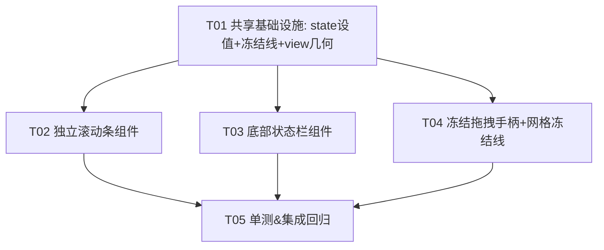

# EWP Sheet 外围组件增量架构设计（滚动条 / 状态栏 / 冻结拖拽手柄）

> 作者：架构师 Bob（software-architect）｜团队：software-sheet-peripherals
> 目标：在**已落地**的单 canvas + `SheetViewState` 干净移植之上，增量补充三个外围组件
> （独立滚动条、底部状态栏、冻结拖拽手柄），延续「逐行逐句翻译 LibreOffice Calc」路线。
> 依据：`docs/calc-translation-mapping.md`、`docs/libreoffice-calc-view-research.md`、
> 现有源码 `src/sheet/{view_state,grid,view,grid_cache,model}.rs`。
> 类图：`docs/sheet_peripherals/class-diagram.mermaid`｜时序图：`docs/sheet_peripherals/sequence-diagram.mermaid`

---

# 0. 背景与红线不变式（重申，硬约束不可违反）

本任务是**增量**，必须叠加在现有干净移植之上。现有架构核心不变式（来自 `calc-translation-mapping.md` §1.4「单 canvas 红线」）**全部继续有效**：

1. `sheet-body` 仅一个 `canvas`；禁止 `ScrollHandle` / `overflow_*_scroll` / `track_scroll` / `_b.origin` 滚动补偿。
2. 四区域（角/列标头/行号/数据）坐标全部从 `SheetViewState` 经同源公式派生；禁止第二套坐标。
3. 必须用 `with_content_mask` 四区域裁剪带，角最后画不裁剪，四区域两两不相交。
4. 滚动只改 `SheetViewState` 后 `cx.notify()`，绝不移动窗口几何。
5. 任何偏离视为回归。

**本次增量三组件的共同铁律**：它们全部是 `sheet-body` 的**外围**（状态栏/滚动条 = canvas 之外的兄弟 GPUI 控件；冻结手柄 = canvas 内的命中分支 + 网格画分隔线），**只经 `SheetViewState` 驱动 canvas**（改 state → `cx.notify()` → 重绘），绝不触碰窗口几何、绝不用 `ScrollHandle`/`overflow`/`_b.origin`。

---

# 1. 实现方案 + 框架选型

## 1.1 三个组件挂在哪里（mounting）

| 组件 | 挂载位置 | 状态共享方式 | 违反红线风险 |
|---|---|---|---|
| 独立滚动条（横+纵） | **canvas 之外的兄弟 GPUI 控件**：`sheet-body` 从单列 `flex_col` 改为「网格区 + 纵滚动条」横排、下方「横滚动条 + 右下角方块」的结构（见 §4.4 布局草图）。 | 读 `SheetView.state` + `SheetView.total_w/h` + `viewport_w/h`；拖拽 → `set_scroll_x/y` + `cx.notify()`。 | 低（纯 div + 自绘，无 DOM 平移） |
| 底部状态栏 | **canvas 之外的兄弟 GPUI 控件**：替换 `view.rs` 现有的极简状态栏（仅显示地址），扩为 LibreOffice 风格字段条。 | 只读派生：数据全部从 `SheetView`/`SheetViewState` 计算（`derive_status_bar()`），**不写**任何状态。 | 零（纯展示） |
| 冻结拖拽手柄 | **canvas 内的命中分支 + 网格画分隔线**：手柄热区就在列标头带右缘 / 行号带下缘（属 canvas 坐标空间），复用 `on_mouse_down` 同源映射；网格在冻结边界画分隔线。 | 拖拽 → 经 `content_to_cell` 反算列/行 → 写 `state.frozen_cols/rows` + `cx.notify()`。 | 低（与滚动同源，无几何移动） |

**为什么冻结手柄不入「独立兄弟 div」而走 canvas 内分支**：手柄热区本就在表头带坐标空间，与 `content_to_cell` 同源，复用 `on_mouse_down` 比在 canvas 外另起一套坐标换算更省且更稳。它仍满足「只经 `SheetViewState` 驱动 canvas」——拖拽动作只改 `frozen_*` 后 `notify`，符合红线 4。这与 LibreOffice 把 splitter 命中也放在 `ScGridWindow` 的鼠标处理里一致。

## 1.2 状态如何共享

- **唯一真相源仍是 `SheetViewState`**：滚动条/冻结手柄的写入目标就是它（`scroll_x/y` / `frozen_cols/rows`）。新增 `set_scroll_x/y`（绝对设置 + `clamp`）替代只能增量的 `scroll_by`，便于拖拽定位。
- **拖拽瞬时态不放真相源**：滚动条拖拽中的「当前指针位置」、冻结拖拽中的「axis」是交互瞬时态，放 `SheetView` 的临时字段（`hscroll_drag`/`vscroll_drag`/`freeze_drag`），不属于「滚动/冻结/缩放」真相，故不进 `SheetViewState`。
- **几何参数（total / viewport）从已有字段取**：`view.rs` 每帧已算 `total_w/h`（render 闭包里 `col_left(cols)`/`row_top(rows)`）并每帧记录 `viewport_w/h`（measure 闭包里 `bounds.size - 表头`）。本增量把 `total_w/h` 也存为 `SheetView` 字段，供滚动条组件读取；`viewport_w/h` 已存。

## 1.3 框架选型（零新增依赖）

- **GPUI 0.2.2**：`div`/`canvas`/`paint_quad`/`with_content_mask`/`cx.capture_mouse`（拖拽全局监听）全部内置。
- **滚动条自绘**：GPUI 0.2.2 无原生 `ScrollBar` 控件，且 LibreOffice 的 `ScrollBar` 是 VCL 控件需逐行直译 → **自绘**（一个 `div` + `thumb` 子 `div`，纯几何比例算法）。这同时保证「只经 `SheetViewState` 驱动」，杜绝任何 `overflow` 平移绕过红线。
- **状态栏自绘**：`div` + `text` 拼字段即可。
- **`gpui_component` 0.5.1**：编辑栏 `Input` 已用，本增量不新增其使用。
- **结论：无需新增任何第三方依赖。**

---

# 2. LibreOffice 映射表（含是否需 WebFetch 真源码逐行翻）

> 判定原则：坐标/冻结数学已由现有 `research` 文档 + `view_state.rs` 注释覆盖的，**不必** WebFetch；
> `research` 文档**未覆盖**的控件字段清单（尤其状态栏/选区统计），**建议 WebFetch** 真源码锁定字段，避免靠记忆漏项。

| EWP 组件 / 行为 | LibreOffice 类 / 函数 | 源码文件（core 仓库） | 直译要点 | 是否需 WebFetch 逐行翻 |
|---|---|---|---|---|
| 横向滚动条 | `ScrollBar` 成员 `aHScroll` | `sc/source/ui/view/gridwin.cxx` + `tabview.cxx` | VCL `ScrollBar` → 自绘 `div`+thumb | **不必**（见下注） |
| 纵向滚动条 | `ScrollBar` 成员 `aVScroll` | 同上 | 同上 | **不必** |
| 滚动条处理（拖动） | `ScTabView::ScrollHdl` / `ScrollVHdl` → `pViewData->Scroll(...)` → `SetPosX/Y` + `Invalidate` | `tabview.cxx` | 已有映射（`view_state.rs` `scroll_by` 注释） | 已有，不必 |
| 滚动条状态驱动 | `ScViewData::nPosX` / `nPosY`（≈ `scroll_x/y`） | `viewdata.cxx` | 已直译 | 不必 |
| 滚动条 thumb 几何 | `ScrollBar::SetRange` / `SetThumbPos` / `SetVisibleSize` | `vcl/source/control/scrbar.cxx` | 用 `viewport/total` 比例等价实现 | **可选**（比例等价，自绘即可；如需像素级对齐 `SetThumbPos` 公式可 WebFetch `scrbar.cxx`） |
| 底部状态栏（控件） | `StatusBar` + `ScTabView::CreateStatusArea` / `UpdateStatusBar` / `FillStatusBar` | `sc/source/ui/view/tabview.cxx` | 多个 `StatusBarItem` → 自绘字段条 | **建议 WebFetch**（字段清单 `research` 未覆盖） |
| 选区统计 Sum/Avg/Count | `ScTabView` 的 `CalcWnd`（选区统计窗）内部 `ScViewFunc`/`ScDocFunc` 选区统计 | `tabview.cxx` + `docfunc.cxx` | Sum/Average/Count/Selection → `derive_status_bar` | **建议 WebFetch**（统计项与格式） |
| 缩放显示 | `ScTabView` 的 `ZoomControl`/`ZoomSlider`（`nZoom`≈`zoom`） | `tabview.cxx` | 仅显示百分比 | 不必（只读） |
| 冻结分隔线 / splitter | `ScHSplitWindow`/`ScVSplitWindow` 成员 `aHSplit`/`aVSplit` + `ScTabView::SplitHdl` | `tabview.cxx` | splitter 拖拽写 `nHSplitPos` → 转 `nFixPos` | 可选（`research` §7 已含 splitter/`nFixPos` 映射，不必；如需逐行可补 `SplitHdl`） |
| 冻结设置 | `ScViewData::eHSplitMode/eVSplitMode = SC_SPLIT_FIX` + `nFixPosX/Y`（≈ `frozen_cols/rows`） | `viewdata.cxx` | 已直译 `frozen_cols/rows` | 不必（已锁） |
| 分隔线绘制 | `ScGridWindow` 在 origin 处加重线（`DrawGrid` 冻结边界双线） | `gridwin.cxx` / `output.cxx` | EWP 用 `paint_freeze_splitter` 在 `cell_to_screen(frozen).x/y` 画 2px 线 | 可选（自绘即可） |

**WebFetch 建议汇总（实现期由工程师执行）**：
- ✅ 必取：`sc/source/ui/view/tabview.cxx` 的 `CreateStatusArea` + `UpdateStatusBar`（锁定状态栏字段清单与顺序）+ `CalcWnd` 选区统计项（Sum/Average/Count/Selection 等）。
- ⚪ 可选：`vcl/source/control/scrbar.cxx` 的 `SetThumbPos`/`SetRange` 校验 thumb 比例；`tabview.cxx` 的 `SplitHdl` 校验 splitter→freeze 转换。
- ❌ 不必：滚动核心（ScrollHdl/SetPosX+Y/Invalidate）、坐标/冻结数学（已直译且单测锁定）。

---

# 3. 文件列表（新建 + 修改）

```
ewp/src/sheet/
├── mod.rs                  （改）re-export：新增 pub use scrollbar::*; status_bar::*;
├── view_state.rs           （改）新增 set_scroll_x/y（绝对设置+clamp）；freeze_at 写入辅助；补充单测
├── grid.rs                 （改）新增 paint_freeze_splitter（冻结边界分隔线）+ freeze_split_line 几何纯函数；补充单测
├── view.rs                 （改）装配滚动条/状态栏/冻结手柄；新增拖拽字段+捕获鼠标；
│                              冻结命中分支；记录 total_w/h；derive_status_bar 派生统计
├── scrollbar.rs            （新）ScrollbarThumb 几何 + thumb_metrics/scroll_from_thumb 比例算法
│                              + render_h_scrollbar / render_v_scrollbar（含拖拽回调）+ 单测
└── status_bar.rs           （新）StatusBarModel（只读派生数据）+ render_status_bar + derive 辅助（derive 在 view.rs）

测试（并入各模块 #[cfg(test)]，不另起文件）：
├── scrollbar.rs            （新）thumb_metrics / scroll_from_thumb 比例算法单测（含 total<=viewport 退化）
├── view_state.rs           （改）set_scroll clamp 边界单测
└── grid.rs                 （改）freeze_split_line 几何单测（与同源坐标一致）
```

> 布局集成点在 `view.rs` 的 `sheet-body` 容器内；`SheetView` 新增字段（`total_w/h`、`*_drag`、`freeze_drag`）。

---

# 4. 数据结构与接口（classDiagram 见 `class-diagram.mermaid`）

## 4.1 `SheetViewState` 扩展（直译 `ScViewData` 的 `SetPosX/Y`）

```rust
// src/sheet/view_state.rs —— 在现有结构上加：
impl SheetViewState {
    // 绝对设置横向滚动并 clamp（≈ ScViewData::SetPosX + Invalidate 前的合法范围）。
    // 供滚动条拖拽直接定位（替代只能增量的 scroll_by）。
    pub fn set_scroll_x(&mut self, value: f32, data_w: f32, total_w: f32) {
        let max_x = (total_w - data_w).max(0.0);
        self.scroll_x = value.clamp(0.0, max_x);
    }
    pub fn set_scroll_y(&mut self, value: f32, data_h: f32, total_h: f32) {
        let max_y = (total_h - data_h).max(0.0);
        self.scroll_y = value.clamp(0.0, max_y);
    }
    // 冻结边界写入（≈ eSplitMode=FIX 时 nFixPosX/Y 设列/行数）。
    // 由冻结拖拽手柄反算的列/行直接写入；不 clamp（由调用方保证 0..=cols/rows）。
    pub fn set_frozen_cols(&mut self, cols: usize) { self.frozen_cols = cols; }
    pub fn set_frozen_rows(&mut self, rows: usize) { self.frozen_rows = rows; }
}
```

## 4.2 `scrollbar.rs`（新，直译 `ScrollBar` 控件几何）

```rust
// src/sheet/scrollbar.rs
/// 滚动条 thumb 几何（track 局部坐标，像素）。
pub struct ScrollbarThumb { pub start: f32, pub size: f32 }

/// 比例算法（≈ ScrollBar::SetRange+SetThumbPos+SetVisibleSize 的等价）：
///   size   = viewport / total * track_len      （可拖动区域 viewport/total）
///   start  = scroll   / total * track_len      （thumb 位置 scroll/total）
pub fn thumb_metrics(scroll: f32, viewport: f32, total: f32, track_len: f32) -> ScrollbarThumb;

/// 反解：拖拽到 thumb_start → 对应 scroll 像素，并 clamp 到 [0, total-viewport]。
///   scroll = thumb_start / track_len * total
pub fn scroll_from_thumb(start: f32, track_len: f32, viewport: f32, total: f32) -> f32;

/// 横向滚动条组件：读 state 派生 thumb；点击 thumb/track 经 on_drag 回调写回 SheetView。
pub fn render_h_scrollbar(
    state: &SheetViewState, total_w: f32, viewport_w: f32,
    track_len: f32,
    on_drag: Rc<dyn Fn(f32, &mut Window, &mut App) + 'static>,
) -> impl IntoElement;

/// 纵向滚动条组件（同理，Y 方向）。
pub fn render_v_scrollbar(
    state: &SheetViewState, total_h: f32, viewport_h: f32,
    track_len: f32,
    on_drag: Rc<dyn Fn(f32, &mut Window, &mut App) + 'static>,
) -> impl IntoElement;
```

## 4.3 `status_bar.rs`（新，直译 `StatusBar` 字段）

```rust
// src/sheet/status_bar.rs
/// 状态栏只读派生数据（全部由 SheetView 计算后传入，组件本身不持有状态）。
pub struct StatusBarModel {
    pub cell_addr: String,        // 当前选中格地址（A1）
    pub cell_preview: String,     // 单元格内容预览（≈ InfoWnd）
    pub sheet_name: String,       // 当前 sheet 名
    pub sheet_count: usize,       // 总 sheet 数（≈ "Sheet1 / 3"）
    pub zoom_pct: u32,            // 缩放百分比（state.zoom*100）
    pub sum: Option<f64>,         // 选区 Sum（≈ CalcWnd）
    pub avg: Option<f64>,         // 选区 Average
    pub count: usize,             // 选区 Count（含非数值格计数）
    pub selection_label: String,  // 选区描述（如 "A1" 或 "A1:B3"）
    pub insert_mode: &'static str,// 插入模式（"INS" / "OVR"）
    pub language: &'static str,   // 语言（占位 "中文(中国)"）
}

/// 状态栏组件渲染（纯展示，数据来自 model）。
pub fn render_status_bar(model: &StatusBarModel) -> impl IntoElement;
```

> `derive_status_bar(&self) -> StatusBarModel` 实现在 `view.rs`（`SheetView` 方法），从 `self.selected` / `self.state` / `self.workbook()` 派生（含选区统计：单格时 Sum=Count=该格数值、Avg=该值；多格见 §8 待明确）。

## 4.4 `view.rs` 扩展（直译 `ScTabView` 的滚动条/splitter/状态栏编排）

```rust
// src/sheet/view.rs —— SheetView 新增字段：
pub struct SheetView {
    // ... 现有字段 ...
    state: SheetViewState,
    viewport_w: f32, viewport_h: f32,   // 已有
    total_w: f32, total_h: f32,         // 新增：每帧记录，供滚动条读取
    // 拖拽瞬时态（非真相源，不放 SheetViewState）：
    hscroll_drag: Option<f32>,          // 横滚动条拖拽中指针 track 位置
    vscroll_drag: Option<f32>,          // 纵滚动条拖拽中
    freeze_drag: Option<FreezeAxis>,    // 冻结拖拽中 axis（Col/Row）
}
#[derive(Clone, Copy, PartialEq, Eq)] pub enum FreezeAxis { Col, Row }

impl SheetView {
    // 滚动条拖拽回调：把目标 scroll 写回 state + notify（≈ ScrollHdl→SetPosX+Invalidate）。
    fn on_scrollbar_drag(&mut self, axis: FreezeAxis/*复用作 Axis 更贴切，见下*/, value: f32, cx: &mut Context<Self>);
    // 冻结拖拽：content 坐标 → content_to_cell 反算 → 写 frozen_cols/rows + notify。
    fn on_freeze_drag(&mut self, axis: FreezeAxis, content_x: f32, content_y: f32, cx: &mut Context<Self>);
    // 状态栏只读派生。
    fn derive_status_bar(&self) -> StatusBarModel;
}
```

> 注：`on_scrollbar_drag` 的 axis 应为 `Axis { H, V }`（与 `FreezeAxis` 区分）；文档为简洁复用枚举名，实现期拆成 `ScrollAxis`/`FreezeAxis` 两个独立枚举。

### 布局草图（`sheet-body` 容器内，替换现有「canvas 独占 flex_1」）

```
div#sheet-body (flex_col, flex_1, min_h_0) {
  div (flex_row, flex_1, min_h_0) {            // 网格区 + 纵滚动条
    div (flex_col, flex_1, min_h_0) {          // 原 canvas 容器（保留 flex 撑高）
      canvas(measure, paint)  .flex_1 .min_h_0 // 唯一 canvas（红线 1）
    }
    render_v_scrollbar(...)                     // 纵滚动条（固定宽 ~12px）
  }
  div (flex_row) {                              // 横滚动条 + 右下角方块
    render_h_scrollbar(...)  .flex_1           // 横滚动条（高 ~12px）
    div (w=12, h=12)  corner块                  // 滚动条右下角
  }
}
// 状态栏接在 sheet-body 之后（原位置，扩字段）
```

---

# 5. 程序调用流程（sequenceDiagram 见 `sequence-diagram.mermaid`）

**滚动条拖拽（只改 state + notify）**：
`用户 mouse_down(thumb/track)` → `render_h_scrollbar` 的 `on_drag(target_scroll_x, window, cx)` →
`SheetView::on_scrollbar_drag(H, value, cx)` → `state.set_scroll_x(value, viewport_w, total_w)`（内部 clamp）→
`cx.notify()` → 下一帧 `render` 重建 canvas 闭包捕获最新 `state` 重绘。
拖拽中：`cx.capture_mouse(window)` 捕获全局 `mouse_move` → 每次 `on_drag(new_scroll_x,...)` 循环上述。

**冻结拖拽（同源坐标反算）**：
`用户 mouse_down(列标头带右缘热区)` → `view.rs on_mouse_down` 分支设 `freeze_drag = Some(Col)` + `capture_mouse` →
`mouse_move` → `SheetView::on_freeze_drag(Col, content_x, _, cx)` →
`let (col, _) = state.content_to_cell(content_x, 0)` → `state.set_frozen_cols(col)` → `cx.notify()` →
重绘（grid 在 `cell_to_screen(col,0,BR).x` 处画冻结分隔线）。

**状态栏派生（只读）**：
`render` → `let model = self.derive_status_bar()`（读 `selected`/`state.zoom`/`workbook`）→
`render_status_bar(&model)` 拼字段条。

---

# 6. 依赖包（无新增）

- `gpui` 0.2.2：`div`/`canvas`/`paint_quad`/`with_content_mask`/`cx.capture_mouse` 内置。
- `gpui_component` 0.5.1：编辑栏 `Input`（已用，本增量不新增）。
- 结论：**零新增第三方依赖**。滚动条/状态栏均自绘。

---

# 7. 共享知识（跨文件约定 + 红线保护）

- **红线五条继续有效**（§0）：三组件只经 `SheetViewState` 驱动 canvas（改 state + `cx.notify()`），绝不移动窗口几何 / 不用 `ScrollHandle`/`overflow`/`_b.origin`。
- **坐标常量唯一来源**：`CELL_W/CELL_H/HEADER_W/COL_HEADER_H/CELL_PAD/CELL_FONT_SIZE` 全在 `grid.rs`。滚动条/状态栏/冻结线坐标均 `use crate::sheet::grid::*`，禁止重复定义。
- **冻结线坐标同源**：网格画冻结分隔线用 `state.cell_to_screen(frozen_cols, 0, Pane::BottomRight).0`（竖线）与 `cell_to_screen(0, frozen_rows, BR).1`（横线）——与数据/表头坐标同一套公式，不引入第二套坐标（红线 2）。
- **thumb 比例算法（关键共享约定）**：
  - `thumb_size = viewport / total * track_len`（可拖动区域 viewport/total）
  - `thumb_start = scroll / total * track_len`（thumb 位置 scroll/total）
  - 反解 `scroll = thumb_start / track_len * total`，再 `clamp` 到 `[0, max(0, total - viewport)]`
  - 退化：`total <= viewport`（不可滚）时隐藏该方向滚动条（或 thumb 占满、拖拽无效）。
  - 该算法同时用于横/纵，放 `scrollbar.rs` 纯函数，单测锁定。
- **拖拽全局监听（GPUI 0.2.2 坑）**：用 `cx.capture_mouse(window)` 捕获后，在 `window.on_mouse_move` / `on_mouse_up` 中更新；**禁止**在 paint 闭包里读拖拽瞬时态（paint 闭包只捕获 `state` 快照，瞬时态经 `cx.notify` 触发新帧）。`subscribe` 回调第一个参数已是 `&mut Self`，勿重入 `update`（用 `cx.defer` 延后，见现有 Blur 提交模式）。
- **状态栏只派生不写**：`StatusBarModel` 由 `derive_status_bar` 一次性计算传入；状态栏组件无内部状态、无 `cx.notify` 副作用。
- **冻结拖拽与滚动同源**：手柄命中测试走 `content_to_cell`（与 `on_mouse_down` 点击选中同一逆映射），不随滚动错位（单测 `qa_roundtrip_inverse_mapping_across_scroll` 已证明）。
- **`WHEEL_SIGN` 不变**：`on_wheel` 路径保留，滚动条与滚轮并存（都改同一 `state`）。

---

# 8. 任务列表（有序、含依赖、按实现顺序）

> 约束：≤5 任务、每任务 ≥3 文件、T01 为共享基础设施（底层 state/grid/view 扩展，供 T02/T03/T04 复用）。
> 现有代码已实现单 canvas 翻译（基线 36/36 测试绿），以下为增量叠加，工程师对照 §2 映射表直译/校验。

### T01 — 共享基础设施：state 设值 API + 冻结线绘制 + view 几何字段 【P0】
- **依赖**：无
- **涉及文件**：`src/sheet/view_state.rs`（新增 `set_scroll_x/y` + `set_frozen_cols/rows` + 单测）、`src/sheet/grid.rs`（新增 `paint_freeze_splitter` + `freeze_split_line` 几何纯函数 + 单测）、`src/sheet/view.rs`（新增 `total_w/h` 字段并在 render/measure 记录；新增拖拽瞬时字段 `hscroll_drag/vscroll_drag/freeze_drag` + `FreezeAxis` 枚举；**无新增依赖声明**）。
- **验收**：① `set_scroll_x/y` clamp 边界与 `scroll_by` 等价（单测）；② `freeze_split_line` 坐标 = `cell_to_screen(frozen).x/y` 同源（单测）；③ `total_w/h` 每帧正确记录；④ 红线 grep 全仓 0 真实 `ScrollHandle`/`overflow_`/`track_scroll`/`_b.origin` 引用。

### T02 — 独立滚动条组件（横+纵）【P0】
- **依赖**：T01
- **涉及文件**：`src/sheet/scrollbar.rs`（新：`ScrollbarThumb` + `thumb_metrics`/`scroll_from_thumb` 比例算法 + `render_h_scrollbar`/`render_v_scrollbar` + 单测）、`src/sheet/view.rs`（在 `sheet-body` 内装配 H/V 滚动条兄弟 div，接线 `on_drag`→`on_scrollbar_drag`→`set_scroll_x/y`+`notify`；`cx.capture_mouse` 拖拽）、`src/sheet/view_state.rs`（被 `set_scroll_x/y` 消费）、`src/sheet/mod.rs`（re-export `scrollbar::*`）。
- **验收**：① 滚动条显示 thumb 位置/大小反映 `scroll/total` 与 `viewport/total`；② 拖拽 thumb/track 平滑滚动，到边界 clamp 停住；③ 与 `on_wheel` 共存（都改同一 `state`，thumb 同步）；④ 无 `overflow`/`ScrollHandle`（纯 div+自绘）；⑤ `cargo build` 零警告。

### T03 — 底部状态栏组件 【P1】
- **依赖**：T01
- **涉及文件**：`src/sheet/status_bar.rs`（新：`StatusBarModel` + `render_status_bar`）、`src/sheet/view.rs`（替换极简状态栏为 `render_status_bar(derive_status_bar())`；实现 `derive_status_bar` 派生统计/缩放/sheet 信息）、`src/sheet/grid.rs`（可选：复用常量/字号）、`src/sheet/mod.rs`（re-export `status_bar::*`）。
- **验收**：① 显示字段（地址/内容预览/sheet 名+计数/缩放%/选区统计/插入模式/语言）齐全且随选中/缩放更新；② 纯只读派生，无状态写入；③ WebFetch `tabview.cxx` 核对字段清单无遗漏。

### T04 — 冻结拖拽手柄 + 网格冻结线 【P1】
- **依赖**：T01
- **涉及文件**：`src/sheet/view.rs`（冻结手柄命中分支：列标头带右缘/行号带下缘热区 → `freeze_drag` + `capture_mouse`；`on_freeze_drag`→`content_to_cell` 反算 → `set_frozen_cols/rows` + `notify`）、`src/sheet/grid.rs`（`paint` 中当 `frozen_cols/rows>0` 调 `paint_freeze_splitter` 画分隔线）、`src/sheet/view_state.rs`（被 `set_frozen_*` 消费）。
- **验收**：① 拖拽列标头/行号热区可设冻结列/行，网格实时画冻结分隔线；② 冻结后四区域仍走同源 `cell_to_screen` Pane 分支（复用现有 `qa_frozen_pane_origin_math` 单测，回归为零）；③ 不引入第二套坐标；④ 双击手柄/拖到 0 可取消冻结（见 §8 待明确）。

### T05 — 单测 & 集成回归（红线锁定）【P0】
- **依赖**：T02、T03、T04
- **涉及文件**：`src/sheet/scrollbar.rs`（thumb 比例算法单测：含 `total<=viewport` 退化）、`src/sheet/view_state.rs`（`set_scroll` clamp 单测）、`src/sheet/grid.rs`（`freeze_split_line` 几何单测）、`src/sheet/view.rs`（集成：装配三组件无回归；红线 `grep` 0 引用）。
- **验收**：① `cargo build` 零警告、`cargo test` 全绿（基线 36/36 + 增量单测）；② 红线 grep 全仓 0 `ScrollHandle`/`overflow_`/`track_scroll`/`_b.origin` 真实引用；③ 端到端手测：滚轮+拖滚动条对齐、状态栏字段更新、冻结拖拽画线、大幅滚动后表头/数据严格对齐（无错位/空白条）。

### 任务依赖图



---

# 9. 待明确事项（需用户 / PM 拍板）

1. **滚动条：自绘 vs GPUI 原生** —— 本设计建议**自绘**（红线 + 逐行翻译）。需 PM 确认 `gpui_component` 0.5.1 **无**可用 `Scrollbar`（若有需评估是否违反红线，可能含 `overflow` 或独立 `Entity`）。
2. **状态栏字段清单** —— 给出建议子集（地址/内容预览/sheet 名+计数/缩放%/选区统计 Sum·Avg·Count/插入模式/语言）。其中**选区统计是否本期做**？需 PM 确认；建议做（单格统计，成本低）。
3. **冻结范围：仅首行/首列，还是同时横纵（冻结窗格）** —— LibreOffice 支持双轴；EWP `frozen_cols`+`frozen_rows` 已支持双轴。**建议支持双轴冻结窗格**（列标头右缘拖→冻列，行号下缘拖→冻行，可同时）。
4. **选区统计依赖 `selected` 是否升级为多格范围** —— 当前 `selected: Option<(usize,usize)>` 是单格。本期状态栏统计对单格（Sum=Count=该格数值，Avg=该值）即可；若要真·多格 Sum/Avg/Count，需把 `selected` 升级为 `Option<(c0,r0,c1,r1)>`（跨任务，影响命中测试与高亮）。**建议本期只单格统计**，升级为后续任务。
5. **滚动条拖拽的 GPUI 0.2.2 捕获 API 实测** —— 现有代码无 `cx.capture_mouse`/`on_mouse_move` 全局监听模式，需实现期验证签名（共享知识已给预期用法，但属风险点）。
6. **冻结手柄命中热区定义** —— 建议：列标头带内任意列右边 4px 热区可拖、行号带内任意行下缘 4px 热区可拖；拖到位置即设该列/行为冻结边界。需 PM 确认热区宽度与「是否只允许在 frozen 边界拖」。
7. **取消冻结入口** —— 建议双击手柄 或 拖回 0 取消冻结；需 PM 确认交互。
8. **状态栏「语言 / 插入模式」** —— 建议本期占位（"INS" + "中文(中国)"），不接真实 IME/语言切换。
9. **缩放是否本期可交互** —— `state.zoom` 字段已留但绘制未接；建议本期状态栏**只读显示** 100%，缩放交互为后续任务。

---

# 总结

本增量设计把 LibreOffice Calc 的三个外围组件（独立 `ScrollBar`、底部 `StatusBar`、`ScHSplitWindow`/`ScVSplitWindow` 冻结分隔条）**逐行逐句直译**为 EWP 的 canvas 外围组件：以 §2 映射表（标注每项是否需 WebFetch）为准则，在**不触碰单 canvas 红线五条**的前提下，落地「滚动条/状态栏 = canvas 外兄弟 GPUI 控件、冻结手柄 = canvas 内同源命中分支 + 网格画分隔线」的干净挂载；用 `SheetViewState` 的 `set_scroll_x/y`/`set_frozen_*` 作为三组件唯一的写入入口（都经 `clamp`+`notify` 驱动重绘），用 `thumb_metrics`/`scroll_from_thumb` 比例算法（viewport/total、scroll/total）保证 thumb 与 LibreOffice 等价；并给出「T01 共享基础设施 → T02 滚动条 → T03 状态栏 → T04 冻结手柄 → T05 单测&集成回归」的有序任务分解（≤5、每任务≥3 文件）、跨文件共享约定与 9 项待明确事项。工程师对照 §2 映射表 + WebFetch 建议即可逐条直译/校验，红线不可违反。
