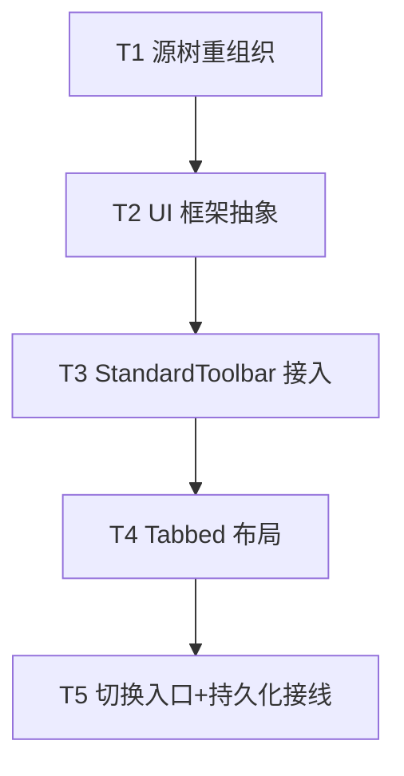

# EWP 多套 UI 界面框架 + 按文档类型分目录重组织 — 架构设计

> 作者：架构师（高见远）｜阶段：架构设计 + 任务分解（标准 SOP 架构阶段）
> 依据：`MEMORY.md`（GPUI 0.2.2 坑 + 现有架构）、LibreOffice `core_1` 仓库（UI 框架移植）、现有 `src/` 源码
> 类图：`docs/class-diagram.mermaid`｜时序图：`docs/sequence-diagram.mermaid`

---

## 1. 实现方案 + 框架选型（含 LibreOffice 对应物映射表）

### 1.1 目标

为 EWP 设计一个**轻量但可扩展的多 UI 框架**，移植 LibreOffice 的架构思想（而非逐行转译）：

- 一个 **UI 模式枚举 / 注册表**（当前 `standard` / `tabbed`，可扩展）
- 一个 **`UiLayout` trait**（渲染顶部 chrome：工具栏 / 笔记本栏）
- 一个 **布局管理器** `UiLayoutManager`（按当前模式 + 持久化偏好切换、组合布局）
- 至少两套具体布局：`StandardToolbar`（= 当前行为）、`Tabbed`（紧凑标签页栏）
- **保持最小可扩展**：新增一套 UI 只需实现 `UiLayout` 并 `register_layout`

### 1.2 与 LibreOffice 的对应物映射（移植证据）

> 下列路径/类型名均取自 `/Users/yangzhenxun/Documents/LibreOffice/core_1`，主理人可按路径核对。

| LibreOffice 概念（文件 / 类型名） | EWP 对应物 | 映射说明 |
|---|---|---|
| `framework::UIElement`（结构体，`include/framework/uielement.hxx` L57-100：`m_aType`/`m_aName`/`m_xUIElement`/`m_bVisible`）+ XUIElement 接口 | `ui::layout::UiLayout` trait（`id`/`label`/`render_top`）+ `ChromeCtx` | 一个可渲染的 UI 单元（顶部 chrome）。LO 用 name/type/visibility 描述元素；EWP 用 trait 方法直接产出元素树。 |
| `framework::ToolbarLayoutManager`（`framework/source/layoutmanager/toolbarlayoutmanager.hxx` + `.cxx`：`m_aUIElements`(L268)、`attach(...xModuleCfgMgr...)`(L67)、`createToolbar`/`destroyToolbar`/`showToolbar`/`doLayout`/`requestToolbar`/`getToolbar`） | `ui::manager::UiLayoutManager` | 持有已装载布局集合、当前激活模式，负责 `render_chrome`（= doLayout + createUIElement）。 |
| `framework::UIElementFactoryManager`（`framework/source/uifactory/uielementfactorymanager.cxx`：`registerFactory(aType,aName,aModuleIdentifier,aFactoryImpl)`(L374)、`getFactory(ResourceURL,ModuleIdentifier)`(L373)、`createUIElement(ResourceURL,Args)`(L369)；底层 `m_aFactoryManagerMap` 按 `getHashKeyFromStrings(type,name,module)`） | `UiLayoutManager::registry` + `register_layout` / `current_layout` | 模式注册表：`id → Box<dyn UiLayout>`。LO 按 (type,name,module) 三级 key；EWP 简化为 `&'static str` id（文档类型维度由 `per_model_default` 承载）。 |
| `framework::ModuleUIConfigurationManager`（`framework/source/uiconfiguration/moduleuiconfigurationmanager.cxx`：按 module 装载 UI 配置，即 Writer/Calc/Impress 各自有哪些 toolbar） | `UiLayoutManager::per_model_default` + `default_mode_for(ModelKind)` | 每种文档类型可有独立默认 UI 模式（v1 先全局默认，槽位预留）。 |
| `sfx2::SfxNotebookBar`（`include/sfx2/notebookbar/SfxNotebookBar.hxx` + `sfx2/source/notebookbar/SfxNotebookBar.cxx`：`IsActive(bool)`(L227)、`ExecMethod(SfxBindings&,rUIName)`(L293，调 `lcl_setNotebookbarFileName(eApp,rUIName)` 保存并 `Invalidate(SID_NOTEBOOKBAR)`)、`StateMethod`(L315 重载)、`ReloadNotebookBar`；`lcl_getNotebookbarFileName(eApp)`(L141) 读 `officecfg::Office::UI::ToolbarMode::ActiveWriter/Calc/Impress::get()`；`lcl_getCurrentImplConfigRoot()`(L160) 指向注册表 `org.openoffice.Office.UI.ToolbarMode`） | `UiLayoutManager::set_mode` + `ui::persistence`（`load_ui_mode`/`save_ui_mode`） | 持久化激活模式到 `data_dir()/ui_mode.json`；`IsActive` → `current_mode()`；`ExecMethod` 保存 → `set_mode` + 持久化 + 通知重绘。 |
| `sfx2::NotebookbarTabControl`（`sfx2/source/notebookbar/NotebookbarTabControl.cxx`/`.hxx`：NotebookBar 内的标签页控件） | `ui::tabbed::TabbedLayout` | 紧凑标签页栏（文档类型切换 tab + 常用动作行）。 |
| `vcl::EnumContext::Application`（Writer/Calc/Impress/Draw） | `ui::layout::ModelKind`（Text/Sheet/Slide） | 文档类型维度，驱动 per-model 默认与 tab 内容。 |

### 1.3 关键设计决策（GPUI 0.2.2 友好）

- **`UiLayout::render_top` 返回 `gpui::AnyElement`** 而非 `impl IntoElement`：使 trait 可 `dyn` 分发（`Box<dyn UiLayout>`），注册表才能存异构布局。每个视图 `render` 内先 `body.into_any_element()` 再交给管理器（见 §4、§7 GPUI 坑）。
- **管理器作 GPUI global**：`cx.set_global(UiLayoutManager::new_with_defaults())` 在启动注册布局；运行时 `cx.global_mut()` 改模式。与 `ThemeColors::current()` 同款全局访问风格。
- **`ChromeCtx` 携带视图提供的 `tool_group: AnyElement` + 回调**：`StandardToolbar` 只画**统一框**（标题 + 工具组 + 保存/侧栏），各视图把现有按钮组塞进 `tool_group`，从而**行为不变**（文本 B/I/U/≡、表格 ＋工作表、演示 新建 全部保留）。
- **零新依赖**：复用 `serde`/`serde_json`（已有，见 `data.rs`）、`gpui`（AnyElement/App/Window global）、`gpui_component`（已用）。持久化复用 `data::data_dir()`。

---

## 2. 目标文件列表及相对路径（重组织后的完整 src/ 树）

> 标注 `→` 为从现有位置移动；`+新增` 为新文件；`（改）` 为原地修改路径接线。

```
ewp/src/
├── main.rs                          （改）入口：mod 声明 + re-export + 启动装载 UiLayoutManager
├── app_menus.rs                     （改）app 级菜单：新增「界面模式」子菜单（保持 ewp_actions 依赖）
├── ewp_actions.rs                   （改）新增 SetUiMode action（切换入口用）
├── styles.rs                        （不变）ThemeColors 核心
├── data.rs                          （不变）data_dir() + 现有 JSON 机制（持久化复用）
├── settings_view.rs                 （改·可选）设置页增加界面模式选择
├── model/                           （改）仅保留共享模型胶水
│   ├── mod.rs                       （改）Model 枚举 + 从子目录 re-export Document/Workbook/Presentation
│   ├── common.rs                    （不变）Id/TextStyle/Rgb 等
│   ├── filter.rs                    （不变）OOXML 过滤器 trait
│   └── ser.rs                       （改）测试中 crate::model::text::Document → crate::text::model::Document
├── text/                            （+新增目录）Text 文档类型
│   ├── mod.rs                       （+新增）pub use crate::text::model::*; pub use crate::text::editor_view::EditorView;
│   ├── model.rs                     （→ 原 model/text.rs）Document/Block/Paragraph/Run
│   └── editor_view.rs               （→ 原 editor_view.rs）EditorView（拆出顶部栏，委托框架）
├── sheet/                           （+新增目录）Sheet 文档类型
│   ├── mod.rs                       （+新增）pub use crate::sheet::model::*; pub use crate::sheet::view::SheetView; ...
│   ├── model.rs                     （→ 原 model/sheet.rs）Workbook/Sheet/Cell/...
│   ├── view.rs                      （→ 原 sheet_view.rs）SheetView（不动内部 sheet-body/canvas/坐标）
│   ├── grid.rs                      （→ 原 sheet_grid.rs）常量 + 无状态绘制助手
│   ├── grid_cache.rs                （→ 原 sheet_grid_cache.rs）GridTextCache
│   └── view_state.rs                （→ 原 sheet_view_state.rs）SheetViewState
├── slide/                           （+新增目录）Slide 文档类型
│   ├── mod.rs                       （+新增）pub use crate::slide::model::*; pub use crate::slide::view::SlideView;
│   ├── model.rs                     （→ 原 model/slide.rs）Presentation/Slide/Shape/Rect
│   └── view.rs                      （→ 原 slide_view.rs）SlideView
├── ui/                             （+新增目录）多 UI 框架（本设计核心）
│   ├── mod.rs                       （+新增）pub mod layout; pub mod manager; pub mod standard; pub mod tabbed; pub mod persistence;
│   ├── layout.rs                    （+新增）UiLayout trait + ModelKind + ChromeCtx
│   ├── manager.rs                   （+新增）UiLayoutManager（注册表 + GPUI global + render_chrome + set_mode）
│   ├── standard.rs                  （+新增）StandardToolbar（复刻当前顶栏行为）
│   ├── tabbed.rs                    （+新增）TabbedLayout（v1 紧凑标签页栏）
│   └── persistence.rs               （+新增）UiModeSettings + load/save（复用 data::data_dir）
└── extension/                       （不变）
```

### 2.1 移动后必须更新的 `use` 路径（给工程师的接线清单）

| 文件 | 旧路径 | 新路径 |
|---|---|---|
| `main.rs` | `use sheet_view::SheetView;` / `use slide_view::SlideView;` / `use editor_view::EditorView;` | `use sheet::view::SheetView;` / `use slide::view::SlideView;` / `use text::editor_view::EditorView;` |
| `main.rs` | `mod sheet_view; mod slide_view; mod editor_view;` | `mod sheet; mod slide; mod text; mod ui;` |
| `main.rs` | `SheetView::default_model()` / `SlideView::default_model()` | `sheet::view::SheetView::default_model()` 等 |
| `model/mod.rs` | `use crate::model::sheet::Workbook;` 等 + `pub mod sheet/slide/text;` | `pub use crate::text::model::Document;` 等；**删除** `pub mod sheet/slide/text`，保留 `pub mod common/filter/ser` |
| `sheet/view.rs` | `use crate::model::sheet::{Cell,CellValue,Sheet,Workbook};` | `use crate::sheet::model::{...};` |
| `sheet/view.rs` | `use crate::sheet_grid::*;` / `sheet_grid_cache` / `sheet_view_state` | `use crate::sheet::grid::*;` / `crate::sheet::grid_cache` / `crate::sheet::view_state` |
| `sheet/grid_cache.rs` | `use crate::sheet_grid::CELL_FONT_SIZE;` | `use crate::sheet::grid::CELL_FONT_SIZE;` |
| `sheet/view_state.rs` | `use crate::sheet_grid::{...};` | `use crate::sheet::grid::{...};` |
| `text/editor_view.rs` | `use crate::model::text::{Block,Document,Paragraph,Run};` | `use crate::text::model::{...};` |
| `slide/view.rs` | `use crate::model::slide::{Presentation,Shape,ShapeKind,Slide};` + `crate::model::text::Run` | `use crate::slide::model::{...};` + `crate::text::model::Run` |
| `model/ser.rs`（测试） | `use crate::model::text::Document;` | `use crate::text::model::Document;` |

> 注：`sheet/grid.rs`、`sheet/grid_cache.rs`、`sheet/view_state.rs` 三者互引（原 `crate::sheet_grid*`）统一改为 `crate::sheet::grid*` 或相对 `super::grid`。`model/common`/`model/ser` 不变，文档类型模型内的 `use crate::model::common::*` 保持不变。

---

## 3. 数据结构和接口（伪代码）

### 3.1 `ModelKind`（文档类型维度）

```rust
// ui/layout.rs
#[derive(Clone, Copy, PartialEq, Eq, Hash, Debug, Serialize, Deserialize)]
pub enum ModelKind { Text, Sheet, Slide }
impl ModelKind {
    pub fn from_model(m: &Model) -> Self { /* match m { Text=>Text, ... } */ }
}
```

### 3.2 `ChromeCtx`（视图 → 布局的上下文）

```rust
// ui/layout.rs
/// 类比 LibreOffice UIElement（名称/类型/可见性）+ SfxNotebookBar 经 Bindings 绑动作。
pub struct ChromeCtx {
    pub model_kind: ModelKind,
    pub name: SharedString,
    pub dirty: bool,
    /// 视图自身的中间工具按钮组（保留各视图现有按钮：文本 B/I/U/≡，表格 ＋工作表，演示 新建）
    pub tool_group: AnyElement,
    pub on_save: Box<dyn Fn(&ClickEvent, &mut Window, &mut App)>,
    pub on_toggle_sidebar: Box<dyn Fn(&ClickEvent, &mut Window, &mut App)>,
    pub on_format: Box<dyn Fn(&str, &ClickEvent, &mut Window, &mut App)>,
    /// 文档类型切换（Tabbed 用）：打开对应类型新窗口
    pub on_switch_model: Box<dyn Fn(ModelKind, &mut Window, &mut App)>,
}
```

### 3.3 `UiLayout` trait（核心抽象）

```rust
// ui/layout.rs
pub trait UiLayout {
    /// 布局唯一标识（"standard" / "tabbed"），用作持久化 key 与注册表 key
    fn id(&self) -> &'static str;
    /// 菜单显示名（"标准工具栏" / "标签页式"）
    fn label(&self) -> &'static str;
    /// 渲染顶部 chrome，body 为文档内容，置于下方。返回 AnyElement 以便 dyn 分发。
    fn render_top(&self, ctx: &ChromeCtx, body: AnyElement, window: &mut Window, cx: &mut App) -> AnyElement;
}
```

### 3.4 `UiLayoutManager`（布局管理器）

```rust
// ui/manager.rs
pub struct UiLayoutManager {
    registry: HashMap<&'static str, Box<dyn UiLayout>>,   // 类比 UIElementFactoryManager 注册表
    current: &'static str,                                // 类比 SfxNotebookBar "Active"
    per_model_default: HashMap<ModelKind, &'static str>,  // 类比 ModuleUIConfigurationManager
}
impl UiLayoutManager {
    pub fn new_with_defaults() -> Self {
        let mut m = Self { registry: HashMap::new(), current: "standard", per_model_default: HashMap::new() };
        m.register_layout(Box::new(StandardToolbar));     // 注册具体布局
        m.register_layout(Box::new(TabbedLayout));
        m
    }
    pub fn register_layout(&mut self, layout: Box<dyn UiLayout>) { self.registry.insert(layout.id(), layout); }
    pub fn current_layout(&self) -> &dyn UiLayout { self.registry[self.current].as_ref() }
    pub fn current_mode(&self) -> &'static str { self.current }
    pub fn available_modes(&self) -> Vec<(&'static str, &'static str)> {
        self.registry.values().map(|l| (l.id(), l.label())).collect()
    }
    /// 切换模式 + 持久化 + 通知重绘（类比 SfxNotebookBar::ExecMethod）
    pub fn set_mode(&mut self, id: &'static str) {
        if self.registry.contains_key(id) {
            self.current = id;
            persistence::save_ui_mode(&UiModeSettings {
                default: id.to_string(),
                per_model: self.per_model_default.iter().map(|(k,v)| (format!("{:?}", k), v.to_string())).collect(),
            });
            // 通知所有窗口重绘（cx.notify 各视图 entity）
        }
    }
    /// 类比 ModuleUIConfigurationManager：按文档类型取默认模式（v1 回退 current）
    pub fn default_mode_for(&self, kind: ModelKind) -> &'static str {
        self.per_model_default.get(&kind).copied().unwrap_or(self.current)
    }
    /// 渲染 chrome：委托当前布局（类比 ToolbarLayoutManager::doLayout + createUIElement）
    pub fn render_chrome(&self, ctx: ChromeCtx, body: AnyElement, window: &mut Window, cx: &mut App) -> AnyElement {
        self.current_layout().render_top(&ctx, body, window, cx)
    }
    // GPUI global 访问（与 ThemeColors::current 同款）
    pub fn global(cx: &App) -> &UiLayoutManager { cx.global::<UiLayoutManager>() }
    pub fn global_mut(cx: &mut App) -> &mut UiLayoutManager { cx.global_mut::<UiLayoutManager>() }
}
```

### 3.5 持久化接口（复用 `data::data_dir()`）

```rust
// ui/persistence.rs
use serde::{Serialize, Deserialize};
use crate::data::data_dir;
use std::collections::HashMap;
use std::path::PathBuf;
use std::fs;

#[derive(Default, Serialize, Deserialize)]
pub struct UiModeSettings {
    #[serde(default = "default_mode")] pub default: String,            // "standard" | "tabbed"
    #[serde(default)] pub per_model: HashMap<String, String>,          // 预留每文档类型默认
}
fn default_mode() -> String { "standard".to_string() }
fn ui_mode_file() -> PathBuf { data_dir().join("ui_mode.json") }       // 复用 data_dir()，零新依赖

pub fn load_ui_mode() -> UiModeSettings {
    match fs::read_to_string(ui_mode_file()) {
        Ok(c) => serde_json::from_str(&c).unwrap_or_default(),
        Err(_) => UiModeSettings::default(),
    }
}
pub fn save_ui_mode(s: &UiModeSettings) {
    if let Ok(j) = serde_json::to_string_pretty(s) {
        let _ = fs::write(ui_mode_file(), j);
    }
}
```

### 3.6 两套具体布局（签名草图）

```rust
// ui/standard.rs —— 复刻 editor_view::top_toolbar 现有框（标题 | tool_group | 保存+侧栏）
pub struct StandardToolbar;
impl UiLayout for StandardToolbar {
    fn id(&self) -> &'static str { "standard" }
    fn label(&self) -> &'static str { "标准工具栏" }
    fn render_top(&self, ctx: &ChromeCtx, body: AnyElement, window: &mut Window, cx: &mut App) -> AnyElement {
        // 左：title(name + dirty*)；中：ctx.tool_group；右：save(脏高亮) + sidebar toggle
        // 配色取 c.sidebar_bg / c.border（与现 top_toolbar 一致）
        // 返回 div().flex_col().child(top_bar).child(body)
    }
}

// ui/tabbed.rs —— v1 紧凑双行：上行文档类型 tab + 下行常用动作
pub struct TabbedLayout;
impl UiLayout for TabbedLayout {
    fn id(&self) -> &'static str { "tabbed" }
    fn label(&self) -> &'static str { "标签页式" }
    fn render_top(&self, ctx: &ChromeCtx, body: AnyElement, window: &mut Window, cx: &mut App) -> AnyElement {
        // 上行：Text/Sheet/Slide 三个 tab（点 → ctx.on_switch_model(kind)），右侧当前名
        // 下行：保存 / 粗体 / 斜体 / 下划线 / 侧栏（常用动作固定行）
        // 返回 div().flex_col().child(tab_row).child(action_row).child(body)
    }
}
```

---

## 4. 程序调用流程（时序图）

> 完整 Mermaid 见 `docs/sequence-diagram.mermaid`，类图见 `docs/class-diagram.mermaid`。

**启动期（装载持久化模式）**
1. `main.rs::main` → `cx.set_global(UiLayoutManager::new_with_defaults())`（注册 Standard/Tabbed）。
2. `ui::persistence::load_ui_mode()` 读 `ui_mode.json`。
3. `UiLayoutManager::set_mode(default)`（无效 id 回退 `"standard"`）。
4. `open_editor()` 按模型类型打开各文档窗口（`text/sheet/slide` 视图）。

**渲染期（每帧构建 chrome）**
1. 视图 `render`：先 `body = self.render_body(window, cx)`（文档内容，**不含顶部栏**，Sheet 内部 canvas/坐标完全不动）。
2. 构造 `ChromeCtx { model_kind, name, dirty, tool_group(现有按钮组), callbacks }`。
3. `UiLayoutManager::global(cx).render_chrome(ctx, body.into_any_element(), window, cx)`。
4. 管理器取 `current_layout()` → `layout.render_top(&ctx, body, window, cx)` → 返回 `AnyElement`（顶栏 + body）。
5. 窗口显示。

**运行时切换**
1. 用户点菜单「视图 > 界面模式 > 标签页式」→ 触发 `SetUiMode("tabbed")` action。
2. `main.rs::setup_actions` 的 `on_action::<SetUiMode>` → `UiLayoutManager::global_mut(cx).set_mode("tabbed")`。
3. `set_mode` 内 `persistence::save_ui_mode(...)` 写盘 + 通知所有窗口 `cx.notify()`。
4. 下一帧各视图 `render` 改走 `TabbedLayout`。

---

## 5. 任务列表（有序、含依赖、按实现顺序）

> 约束：≤5 任务、每任务 ≥3 文件、按功能模块分组、T1 为基础设施（源树重组织 + main.rs 模块接线）。

### T1 — 源树按文档类型重组织（纯移动 + mod 接线，零行为变更）
- **依赖**：无
- **涉及文件**：移动 `editor_view.rs→text/editor_view.rs`、`sheet_view.rs→sheet/view.rs`、`slide_view.rs→slide/view.rs`、`model/text.rs→text/model.rs`、`model/sheet.rs→sheet/model.rs`、`model/slide.rs→slide/model.rs`、`sheet_grid.rs→sheet/grid.rs`、`sheet_grid_cache.rs→sheet/grid_cache.rs`、`sheet_view_state.rs→sheet/view_state.rs`；新增 `text/mod.rs`、`sheet/mod.rs`、`slide/mod.rs`；修改 `main.rs`（mod 声明 + 全部 `use crate::*` 路径）、`model/mod.rs`（改 re-export、删 `pub mod sheet/slide/text`）、`sheet/view.rs`/`sheet/grid_cache.rs`/`sheet/view_state.rs`/`text/editor_view.rs`/`slide/view.rs`/`model/ser.rs` 的 `use` 路径（见 §2.1）。
- **预计**：新增 3 文件 + 移动 9 文件 + 修改 6 文件（共 ~18）。
- **验收**：`cargo build` 零错误零警告；行为完全不变（无功能改动）；所有 `crate::` 路径正确。

### T2 — 抽多 UI 框架抽象（UiLayout trait + 模式枚举 + 管理器 + 持久化）
- **依赖**：T1（main.rs 模块划分完成后加 `mod ui;`）
- **涉及文件**：`ui/mod.rs`、`ui/layout.rs`（UiLayout/ModelKind/ChromeCtx）、`ui/manager.rs`（UiLayoutManager + GPUI global + render_chrome + set_mode 骨架）、`ui/persistence.rs`（UiModeSettings load/save 复用 data_dir()）。
- **预计**：新增 4 文件。
- **验收**：`ui` 模块编译；`new_with_defaults()` 注册两布局；`set_mode`/`current_mode`/`available_modes` 工作；`load/save_ui_mode` round-trip 一致（写再读相同）。视图尚未接入。

### T3 — 把当前 toolbar 行为迁入 StandardToolbar 布局（行为不变）
- **依赖**：T1、T2
- **涉及文件**：`ui/standard.rs`（实现 `render_top`，复刻 `editor_view::top_toolbar` 框：title + tool_group + 保存/侧栏，配色同 `c.sidebar_bg`/`c.border`）、`text/editor_view.rs`（拆 `render_body` + 构造 `ChromeCtx{tool_group=现有 B/I/U/≡ 组, on_save, on_toggle_sidebar, on_format}`，删自身顶部栏重复实现）、`sheet/view.rs`（tool_group=现有 ＋工作表 组，保存逻辑保留）、`slide/view.rs`（tool_group=现有 新建 组）。
- **预计**：修改/新增 4 文件。
- **验收**：三种文档顶部栏外观/按钮/行为与原版逐一对齐（title/dirty、格式按钮、保存、侧栏、sheet ＋工作表、slide 新建）；编译通过；可手测。

### T4 — 实现 Tabbed 布局（最简可用）
- **依赖**：T3（StandardToolbar 跑通、ChromeCtx 稳定）
- **涉及文件**：`ui/tabbed.rs`（TabbedLayout::render_top：双行紧凑栏——上行文档类型 tab（Text/Sheet/Slide）触发 `on_switch_model`；下行常用动作 保存/粗体/斜体/下划线/侧栏）、`ui/manager.rs`（available_modes 已含 tabbed）、`ui/layout.rs`（ChromeCtx.on_switch_model 接线）。
- **预计**：新增 1 + 修改 2 文件。
- **验收**：`set_mode("tabbed")` 后顶部变紧凑标签页栏；点文档类型 tab 打开对应类型新窗口（`on_switch_model`）；保存/B/I/U/侧栏可用；编译通过。

### T5 — 模式切换入口（菜单/设置）+ 持久化接线
- **依赖**：T4
- **涉及文件**：`ewp_actions.rs`（新增 `SetUiMode` action）、`app_menus.rs`（「视图 > 界面模式」子菜单：标准工具栏/标签页式）、`main.rs`（`setup_actions` 加 `on_action::<SetUiMode>`；启动时 `set_global` + `set_mode(load_ui_mode().default)`）、`ui/manager.rs`（`set_mode` 内调 `save_ui_mode`）、`ui/persistence.rs`（load/save 接 `data_dir()/ui_mode.json`）、`settings_view.rs`（可选：设置页加界面模式选择）。
- **预计**：修改/新增 5+ 文件。
- **验收**：菜单切模式即时生效、跨窗口/跨重启保持；`ui_mode.json` 正确读写；编译通过；端到端手测。

### 任务依赖图



---

## 6. 依赖包列表

**无需新增任何依赖。**

- `serde` / `serde_json`：已存在于 `Cargo.toml`（`data.rs` 使用），持久化直接复用。
- `gpui`（0.2.2）：`AnyElement`、`App`/`Window` global（`set_global`/`global`/`global_mut`）、`ClickEvent` 等均为内置。
- `gpui_component`（0.5.1）：已用，框架不新增其用法。
- `rust_i18n`：已用，菜单文案走 `t!()`。

> 新增结构纯 Rust trait/struct + 现有 JSON 持久化，符合「尽量不引新依赖」约束。

---

## 7. 共享知识（跨文件约定）

- **mod 接线约定**：每个文档类型目录含 `mod.rs`，re-export 该类型主视图与模型（如 `sheet/mod.rs`：`pub use crate::sheet::view::SheetView; pub use crate::sheet::model::{Workbook, Sheet, Cell};`）。root `model/mod.rs` 只保留 `common`/`filter`/`ser` + 从子目录 re-export `Document`/`Workbook`/`Presentation` + `Model` 枚举。
- **use 路径规范**：文档类型相关一律 `crate::text::*`/`crate::sheet::*`/`crate::slide::*`；共享核心走 `crate::model::common`/`crate::model::ser`/`crate::data`/`crate::styles`/`crate::ewp_actions`/`crate::app_menus`。
- **与 Sheet 内部渲染的协作边界（🔴 不动）**：框架只套**最外层 chrome**（顶部栏 + 把 body 放下方）。**绝不**改动 `SheetView` 内部的 `sheet-body` 单 canvas、`with_content_mask` 裁剪带、统一坐标公式（`HEADER_W + col_left(c) - scroll_x` 等，见 MEMORY.md Sheet 视图架构）。`ChromeCtx` 不携带任何 Sheet 内部状态。
- **GPUI 0.2.2 坑（务必遵守，见 MEMORY.md）**：
  - 可点击元素**先 `.id("唯一串")` 再 `.on_click()`**（布局内所有按钮同理）。
  - `render` 返回 `impl IntoElement`；`UiLayout` trait 方法返回 `AnyElement` 以 dyn 分发；视图 `render` 内先建 `body` 再 `.into_any_element()` 交给管理器。
  - 回调用 `cx.weak_entity()` 捕获视图弱引用，避免 `subscribe` 重入 panic（MEMORY.md InputState 教训）。
  - `Keystroke.key` 是 `String`，按字符串匹配；`track_focus` 是收键硬前提。
- **模式枚举/注册表约定**：id 用 `&'static str`（`"standard"`/`"tabbed"`），注册表 key 同 id；持久化只存 id 字符串，不存在的 id 回退 `"standard"`。
- **持久化约定**：复用 `data::data_dir()`，文件 `ui_mode.json`，结构体 `UiModeSettings`，`load/save` 镜像 `data::load_settings/save_settings`。启动期绝不写相对路径（MEMORY.md）。

---

## 8. 待确认问题（需用户拍板）

1. **Tabbed v1 的 tab 行放什么**：文档类型切换 tab（Text/Sheet/Slide）还是 LibreOffice 式上下文 tab（Home/Insert/…）？后者需更多 action 支撑。建议 v1 = **文档类型切换 tab + 固定常用动作行**（保存/B/I/U/侧栏）。
2. **持久化文件名与字段**：建议 `ui_mode.json`，含 `default` + `per_model`（可选）。是否接受此名？
3. **切换入口位置**：建议「视图(View)」菜单新增「界面模式」子菜单（标准工具栏/标签页式）；是否也在「设置」页放一份？
4. **是否每文档类型独立默认 UI**：如 Sheet 默认 Tabbed、Text 默认 Standard？设计已留 `per_model_default` 槽位但 **v1 先全局默认**，需用户确认是否现在启用。
5. **文档类型切换 tab 的行为**：打开同类型新窗口？还是把当前窗口模型替换为新类型（EWP 当前每窗口一文档，替换模型较复杂）→ 建议**打开新窗口**。
6. **侧栏开关按钮适用范围**：当前仅文本有侧栏；sheet/slide 无。Tabbed 的「侧栏」按钮对 sheet/slide 是否 no-op？需确认。

---

## 9. 风险与待验证（实现期注意）

- `AnyElement` 跨 `render_chrome` 传递时生命周期：视图 `render` 内先建 `body`/`tool_group` 再 `.into_any_element()`，确保二者活到 `render_top` 返回，无悬垂。
- GPUI 0.2.2 `cx.global::<T>()`/`global_mut` 是否可用（0.2.x 有 `set_global`/`global` API，需实作时确认签名；若不可用则降级为 `LazyLock<Mutex<UiLayoutManager>>` 进程级单例）。
- `set_mode` 如何通知所有窗口重绘：GPUI 多窗口下需遍历 `cx.windows()` 或各视图订阅一个全局事件；v1 可在 `on_action::<SetUiMode>` 里对 `cx.active_window()` 及所有已知窗口 `cx.notify`。
- Tabbed 的 `on_switch_model` 打开新窗口逻辑复用 `main.rs::open_editor`（需把该函数可见性从 `fn` 提升为 `pub` 或移到共享模块）。
